# System Design: ระบบดิจิทัลสวนนงนุช

**ฉบับ:** ร่าง 3 · 11 พ.ย. 2026
**ใช้สำหรับ:** คุยกับทีม dev เรื่องสถาปัตยกรรมก่อนเริ่มพัฒนาวันที่ 12 พ.ย. 2026
**ที่มา:** Roadmap v9 (`Nongnooch_Roadmap_v9.pptx`) และ [ROADMAP.md](../roadmap/ROADMAP.md) v2.4 หัวข้อ 2.1, 4.2, 6–9

> **มติ 11 พ.ย. 2026 (ROADMAP.md และสไลด์ v9 อัปเดตตามแล้ว)**
> 1. **Microservices** แทน modular monolith แบ่งตาม domain 8 service ในเฟส 1 ใช้ NATS JetStream + outbox และ 1 schema ต่อ service บน MariaDB cluster เดียว
> 2. **7 ภาษาตั้งแต่เฟส 1:** TH · EN · ZH (ตัวย่อ) · JA · KO · DE · FR (ไม่มี RU)
>
> ผลกระทบต่อแผนงานดู Q19–Q23 และ ROADMAP R23–R24

> **อัปเดตร่าง 3 (ROADMAP v2.4 · สไลด์ v9)**
> 1. **ไทม์ไลน์:** พัฒนาเฟส 1 ถึง 29 ม.ค. 2027, Soft launch 1 มี.ค., Go-live 1 เม.ย. เฟส 2 / 3 / 4 ใช้งาน มิ.ย. / ส.ค. / ต.ค. 2027
> 2. **WeChat Login ย้ายมาเฟส 1** (S2, F1)
> 3. **Push notification นอกแอป** ทั้ง App (FCM / APNs / Huawei Push Kit) และ **Web Push** สำหรับผู้ใช้เว็บ (S7)
> 4. **QR ฝัง Unique ticket ID** สแกน Offline แล้วรู้ว่าเป็นบัตรใบไหน มือถือลูกค้าไม่ต้องอัปเดตอะไร ไม่ใช้ QR เปลี่ยนรหัสของ POC (F4, S5)
> 5. **สมัครสมาชิกต้องกรอกชื่อ และเลขบัตรประชาชน / พาสปอร์ต** เพื่อเช็กสิทธิ์ราคาไทย / ต่างชาติ (F1, F3)
> 6. **ซื้อบัตรให้ผู้ติดตาม และส่งบัตรให้เพื่อน** (F3, F11 ใหม่) · ยกเลิก / เลื่อนวันเองในเฟส 2 (F12 ใหม่)
> 7. ฟีเจอร์จาก POC ของ BD: ที่นั่งต่อรอบการแสดง, Zone / POI, FAQ, ตรวจคำแปล, ค้นหาบัตรที่ประตู (เฟส 1) · ล่าสมบัติ, Tier, Review (เฟส 3) · ของฝากส่งถึงบ้าน, Member QR ที่ POS, นำทาง, Audio Guide (เฟส 4)
> 8. ย้ายสแกนจ่ายในสวนและของฝากไปเฟส 4 ตามสไลด์ CEO (S9 ย้ายหัวข้อ)
> 9. **นอกขอบเขต:** ระบบจัดการรถราง EV และบัตรรายปีแบบ Digital Pass (Wallet, ต่ออายุออนไลน์, อัปเกรดบัตร)

> ภาพทุกภาพสร้างจากไฟล์ `diagrams/*.mmd` ถ้าจะแก้ ให้แก้ที่ `.mmd` แล้วรัน `npm run diagrams` (ดู [README.md](README.md)) ห้ามแก้บล็อก Mermaid ในไฟล์นี้ตรง ๆ เพราะ script จะเขียนทับ

## สารบัญ

0. [วิธีอ่าน](#0-วิธีอ่าน)
1. [System Overview](#1-system-overview)
2. [Tech Stack](#2-tech-stack)
3. [Flow Chart](#3-flow-chart)
4. [Sequence Diagram](#4-sequence-diagram)
5. [คำถามเปิดสำหรับทีม dev](#5-คำถามเปิดสำหรับทีม-dev)

---

## 0. วิธีอ่าน

| สัญลักษณ์ | ความหมาย |
|---|---|
| 🟩 พื้นเขียว | เฟส 1 · Soft launch 1 มี.ค. · Go-live 1 เม.ย. 2027 |
| 🟦 พื้นฟ้า | เฟส 2 · มิ.ย. 2027 · แลกพ้อยรับสิทธิ์ |
| 🟧 พื้นส้ม | เฟส 3 · ส.ค. 2027 · กิจกรรมและผู้สนับสนุน |
| 🟪 พื้นม่วง | เฟส 4 · ต.ค. 2027 · บริการครบวงจร |
| 🟨 เหลือง เส้นประ / `[สมมติฐาน]` | roadmap ยังไม่ได้ระบุ ทีม dev ต้องยืนยัน (รวมไว้ที่หัวข้อ 5) |
| `[[ F1 ... ]]` กล่องขอบคู่ | ลิงก์ไปยัง diagram อื่น ไม่วาดซ้ำในภาพนี้ |
| เลขในวงกลม (sequence) | เลขขั้นตอนสำหรับอ้างอิงในที่ประชุม เช่น "S3 ขั้น 11" |

ไอคอนใน overview และ flow chart มาจาก [Lucide](https://lucide.dev) ซึ่งไม่มีโลโก้แบรนด์ จึงเขียนชื่อเทคโนโลยีไว้ใน label เสมอ ส่วน sequence diagram ใส่ไอคอนไม่ได้ เพราะ Mermaid ยังไม่รองรับ

ใน sequence: ลูกศรหัวเปิด (`-)`) หมายถึง event แบบ async ผ่าน NATS ส่วนลูกศรทึบหมายถึงเรียกแบบ sync (HTTP / gRPC)

---

## 1. System Overview

### 1.1 Context: ใครใช้ระบบ และระบบต่อกับอะไรบ้าง

<!-- diagram:O1 -->


Mermaid source

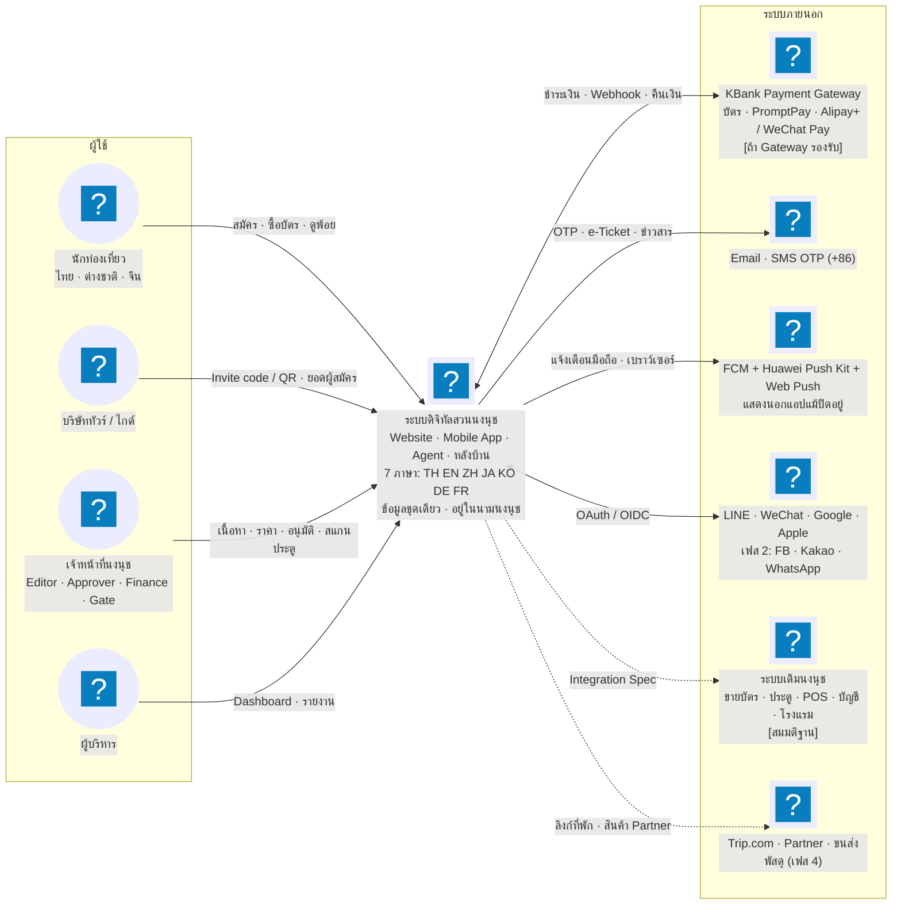
```mermaid
flowchart LR
  subgraph users[ผู้ใช้]
    tourist@{ icon: "lucide:user", form: "circle", label: "นักท่องเที่ยว<br>ไทย · ต่างชาติ · จีน", pos: "b" }
    agent@{ icon: "lucide:users", form: "circle", label: "บริษัททัวร์ / ไกด์", pos: "b" }
    staff@{ icon: "lucide:user-cog", form: "circle", label: "เจ้าหน้าที่นงนุช<br>Editor · Approver · Finance · Gate", pos: "b" }
    exec@{ icon: "lucide:briefcase", form: "circle", label: "ผู้บริหาร", pos: "b" }
  end

  sys@{ icon: "lucide:server", form: "square", label: "ระบบดิจิทัลสวนนงนุช<br>Website · Mobile App · Agent · หลังบ้าน<br>7 ภาษา: TH EN ZH JA KO DE FR<br>ข้อมูลชุดเดียว · อยู่ในนามนงนุช", pos: "b" }

  subgraph ext[ระบบภายนอก]
    kbank@{ icon: "lucide:credit-card", form: "square", label: "KBank Payment Gateway<br>บัตร · PromptPay · Alipay+ / WeChat Pay<br>[ถ้า Gateway รองรับ]", pos: "b" }
    msg@{ icon: "lucide:mail", form: "square", label: "Email · SMS OTP (+86)", pos: "b" }
    push@{ icon: "lucide:bell", form: "square", label: "FCM + Huawei Push Kit + Web Push<br>แสดงนอกแอปแม้ปิดอยู่", pos: "b" }
    social@{ icon: "lucide:log-in", form: "square", label: "LINE · WeChat · Google · Apple<br>เฟส 2: FB · Kakao · WhatsApp", pos: "b" }
    legacy@{ icon: "lucide:building-2", form: "square", label: "ระบบเดิมนงนุช<br>ขายบัตร · ประตู · POS · บัญชี · โรงแรม<br>[สมมติฐาน]", pos: "b" }
    trip@{ icon: "lucide:external-link", form: "square", label: "Trip.com · Partner · ขนส่งพัสดุ (เฟส 4)", pos: "b" }
  end

  tourist -->|สมัคร · ซื้อบัตร · ดูพ้อย| sys
  agent -->|Invite code / QR · ยอดผู้สมัคร| sys
  staff -->|เนื้อหา · ราคา · อนุมัติ · สแกนประตู| sys
  exec -->|Dashboard · รายงาน| sys
  sys <-->|ชำระเงิน · Webhook · คืนเงิน| kbank
  sys -->|OTP · e-Ticket · ข่าวสาร| msg
  sys -->|แจ้งเตือนมือถือ · เบราว์เซอร์| push
  sys <-->|OAuth / OIDC| social
  sys <-.->|Integration Spec| legacy
  sys -.->|ลิงก์ที่พัก · สินค้า Partner| trip
```

<!-- /diagram -->

### 1.2 Container และ Module

Backend เป็น **microservices ภาษา Go แบ่งตาม domain** ทุก client เข้าผ่าน **API Gateway** จุดเดียว (ตรวจ JWT, route, rate limit, รวม OpenAPI ของทุก service)

**กติกาที่ทุก service ต้องทำตาม**
- เป็นเจ้าของ schema ของตัวเองบน MariaDB cluster และ**ห้าม join หรืออ่าน schema ของ service อื่น**
- ถ้าต้องรอคำตอบทันที เรียกกันด้วย **gRPC** เช่น ตรวจ invite code หรือ hold พ้อย นอกนั้นสื่อสารด้วย **event ผ่าน NATS JetStream**
- event ต้องเขียนลง **outbox** ใน transaction เดียวกับข้อมูลก่อน แล้วจึง publish จะได้ไม่มีกรณีข้อมูล commit แล้วแต่ event หาย
- consumer ต้องเป็น **idempotent** เพราะ JetStream ส่งแบบ at-least-once
- ส่ง trace และ log ผ่าน **OpenTelemetry**

| Service | Schema | ข้อมูลหลัก | เฟส |
|---|---|---|---|
| Identity | `identity` | OTP, SocialIdentity (LINE, WeChat UnionID, Google, Apple), session / JWT | 1 |
| Member & Point | `member` | Member (ชื่อ, สัญชาติ, เลขบัตรประชาชน / พาสปอร์ต เข้ารหัส + hash), Companion (รายชื่อผู้ติดตาม), Consent, PointLedger (เฟส 2: Redemption · เฟส 3: Tier) | 1 |
| Agent | `agent` | AgentCompany, Guide, InviteCode, Referral | 1 |
| Commerce | `commerce` | Product, PriceRule, Inventory (โควตาต่อวัน + ที่นั่งต่อรอบการแสดง), Order, Payment, Refund, RefundPolicy, Waiting room (เฟส 2: ยกเลิก / เลื่อนวันเอง · เฟส 3: BulkOrder · เฟส 4: Bill, ShopOrder, Shipment) | 1 |
| Ticket & Gate | `ticket` | Ticket (Unique ticket ID), TicketHolder, TicketTransfer, AnnualPass, GateScan, รายการ void สำหรับ snapshot ประตู, sync ระบบเดิม | 1 |
| Content | `content` | เนื้อหา 7 ภาษา, Zone, Poi, FAQ, ตรวจคำแปลที่ขาด, ApprovalRequest, AuditLog (เฟส 4: เส้นทางนำทาง, AudioGuide, ข้อมูลพืช) | 1 |
| Notification | `notify` | Device (ios / gms / hms / web), Web Push subscription, template 7 ภาษา, Push campaign ตั้งเวลา / เลือกกลุ่ม, ประวัติการส่ง | 1 |
| Report | `report` | read model ที่สร้างจาก event | 1 |
| Engagement | `engage` | Quest / Checkpoint / Badge, Leaderboard, Voucher, Event, Sponsor campaign, Review | 3 |
| Partner | `partner` | Partner, Offer, RevenueShare, Hotel / MICE | 4 |

**นอกขอบเขต:** ระบบจัดการรถราง EV (ตำแหน่งรถ แบตเตอรี่ เช็กก่อนออกวิ่ง) และบัตรรายปีแบบ Digital Pass จึงไม่มี service หรือตารางรองรับ

<!-- diagram:O2 -->


Mermaid source

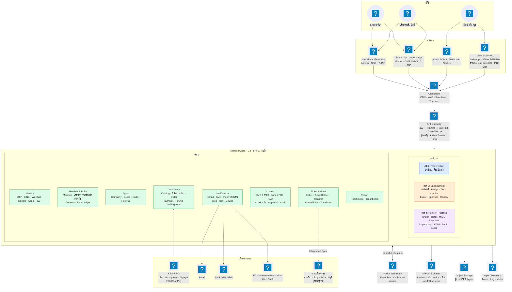
```mermaid
flowchart TB
  subgraph U[ผู้ใช้]
    tourist@{ icon: "lucide:user", form: "circle", label: "นักท่องเที่ยว", pos: "b" }
    agent@{ icon: "lucide:users", form: "circle", label: "บริษัททัวร์ / ไกด์", pos: "b" }
    staff@{ icon: "lucide:user-cog", form: "circle", label: "เจ้าหน้าที่นงนุช", pos: "b" }
  end

  subgraph C[Client]
    web@{ icon: "lucide:globe", form: "square", label: "Website + หน้า Agent<br>Next.js · SSR · 7 ภาษา", pos: "b" }
    app@{ icon: "lucide:smartphone", form: "square", label: "Tourist App · Agent App<br>Flutter · GMS / HMS · 7 ภาษา", pos: "b" }
    admin@{ icon: "lucide:layout-dashboard", form: "square", label: "Admin / CMS / Dashboard<br>Next.js", pos: "b" }
    gate@{ icon: "lucide:scan-line", form: "square", label: "Gate Scanner<br>Web App · Offline Ed25519<br>อ่าน Unique ticket ID · ค้นหาบัตร", pos: "b" }
  end

  cf@{ icon: "lucide:shield", form: "square", label: "Cloudflare<br>CDN · WAF · Rate limit · Turnstile", pos: "b" }
  gw@{ icon: "lucide:network", form: "square", label: "API Gateway<br>JWT · Routing · Rate limit · OpenAPI รวม<br>[สมมติฐาน: Go / Traefik / Kong]", pos: "b" }

  subgraph SVC[Microservices · Go · gRPC ภายใน]
    subgraph P1[เฟส 1]
      direction LR
      identity[Identity<br>OTP · LINE · WeChat · Google · Apple · JWT]:::p1
      member[Member & Point<br>Member · เลขบัตร / พาสปอร์ต เข้ารหัส<br>Consent · PointLedger]:::p1
      agentS[Agent<br>Company · Guide · Invite · Referral]:::p1
      commerce[Commerce<br>Catalog · ที่นั่งการแสดง · Order<br>Payment · Refund · Waiting room]:::p1
      ticket[Ticket & Gate<br>Ticket · TicketHolder · Transfer<br>AnnualPass · GateScan]:::p1
      content[Content<br>CMS 7 ภาษา · Zone / POI · FAQ<br>ตรวจคำแปล · Approval · Audit]:::p1
      notifyS[Notification<br>Email · SMS · Push นอกแอป<br>Web Push · Device]:::p1
      report[Report<br>Read model · Dashboard]:::p1
    end
    subgraph PX[เฟส 2–4]
      direction LR
      p2[เฟส 2: Redemption<br>ยกเลิก / เลื่อนวันเอง]:::p2
      engage[เฟส 3: Engagement<br>ล่าสมบัติ · Badge · Tier · Voucher<br>Event · Sponsor · Review]:::p3
      partner[เฟส 4: Partner + ของฝาก<br>Partner · Hotel / MICE · Shipment<br>In-park pay · นำทาง · Audio Guide]:::p4
    end
  end

  nats@{ icon: "lucide:radio-tower", form: "square", label: "NATS JetStream<br>Event bus · Outbox ต่อ service", pos: "b" }
  db@{ icon: "lucide:database", form: "square", label: "MariaDB cluster<br>1 schema ต่อ service · ห้าม join ข้าม schema", pos: "b" }
  obj@{ icon: "lucide:hard-drive", form: "square", label: "Object Storage<br>รูป · เอกสาร Agent", pos: "b" }
  otel@{ icon: "lucide:activity", form: "square", label: "OpenTelemetry<br>Trace · Log · Metric", pos: "b" }

  subgraph X[บริการภายนอก]
    kbank@{ icon: "lucide:credit-card", form: "square", label: "KBank PG<br>บัตร · PromptPay · Alipay+ / WeChat Pay", pos: "b" }
    mail@{ icon: "lucide:mail", form: "square", label: "Email", pos: "b" }
    sms@{ icon: "lucide:message-square", form: "square", label: "SMS OTP (+86)", pos: "b" }
    push@{ icon: "lucide:bell", form: "square", label: "FCM + Huawei Push Kit + Web Push", pos: "b" }
    legacy@{ icon: "lucide:building-2", form: "square", label: "ระบบเดิมนงนุช<br>ขายบัตร · ประตู · POS · บัญชี<br>[สมมติฐาน]", pos: "b" }
  end

  tourist --> web & app
  agent --> web & app
  staff --> admin & gate
  web & app & admin & gate --> cf --> gw --> SVC
  SVC <-->|publish / consume| nats
  SVC --> db & obj
  SVC -.-> otel
  commerce <--> kbank
  notifyS --> mail & sms & push
  ticket -. Integration Spec .-> legacy

  classDef p1 fill:#dcfce7,stroke:#16a34a
  classDef p2 fill:#dbeafe,stroke:#2563eb
  classDef p3 fill:#ffedd5,stroke:#ea580c
  classDef p4 fill:#f3e8ff,stroke:#9333ea
```

<!-- /diagram -->

### 1.3 Event Map: service ไหน publish / consume event อะไร

เส้นทึบคือ event บน NATS JetStream (ชื่อ event เขียนบนเส้น) ทุก consumer ต้องเป็น idempotent ส่วนการเรียกแบบ gRPC ที่ต้องรอคำตอบทันที ดูได้ใน sequence (S1, S3, S4, S7, S8, S10)

<!-- diagram:O3 -->


Mermaid source

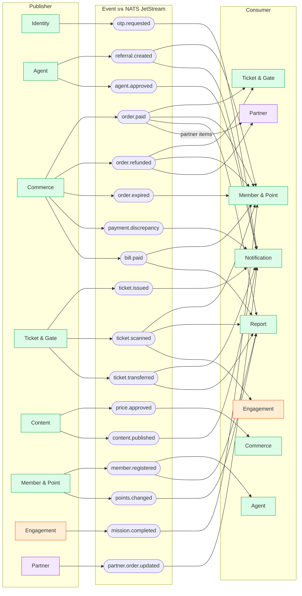
```mermaid
flowchart LR
  subgraph PUB[Publisher]
    direction TB
    identity[Identity]:::p1
    agentP[Agent]:::p1
    commerce[Commerce]:::p1
    ticketP[Ticket & Gate]:::p1
    content[Content]:::p1
    memberP[Member & Point]:::p1
    engageP[Engagement]:::p3
    partnerP[Partner]:::p4
  end

  subgraph EV[Event บน NATS JetStream]
    direction TB
    e1([otp.requested])
    e2([member.registered])
    e3([referral.created])
    e4([agent.approved])
    e5([order.paid])
    e6([order.refunded])
    e7([ticket.issued])
    e8([ticket.scanned])
    e9([price.approved])
    e10([content.published])
    e11([points.changed])
    e12([mission.completed])
    e13([order.expired])
    e14([payment.discrepancy])
    e15([bill.paid])
    e16([partner.order.updated])
    e17([ticket.transferred])
  end

  subgraph SUB[Consumer]
    direction TB
    memberC[Member & Point]:::p1
    agentC[Agent]:::p1
    commerceC[Commerce]:::p1
    ticketC[Ticket & Gate]:::p1
    notifyC[Notification]:::p1
    reportC[Report]:::p1
    engageC[Engagement]:::p3
    partnerC[Partner]:::p4
  end

  identity --> e1 --> notifyC
  memberP --> e2 --> agentC
  e2 --> reportC
  agentP --> e3 --> memberC
  e3 --> notifyC
  agentP --> e4 --> notifyC
  commerce --> e5 --> ticketC
  e5 --> memberC
  e5 --> reportC
  e5 -->|partner items| partnerC
  commerce --> e6 --> ticketC
  e6 --> memberC
  e6 --> partnerC
  ticketP --> e7 --> notifyC
  ticketP --> e8 --> memberC
  e8 --> reportC
  e8 --> engageC
  content --> e9 --> commerceC
  content --> e10 --> notifyC
  memberP --> e11 --> reportC
  engageP --> e12 --> memberC
  commerce --> e13 --> memberC
  commerce --> e14 --> notifyC
  commerce --> e15 --> memberC
  e15 --> reportC
  partnerP --> e16 --> notifyC
  ticketP --> e17 --> notifyC
  e17 --> reportC

  classDef p1 fill:#dcfce7,stroke:#16a34a
  classDef p3 fill:#ffedd5,stroke:#ea580c
  classDef p4 fill:#f3e8ff,stroke:#9333ea
```

<!-- /diagram -->

---

## 2. Tech Stack

| ส่วน | เทคโนโลยี | ไอคอน | เหตุผล / ข้อควรทำ |
|---|---|---|---|
| Website, หน้า Agent, Admin / CMS | **Next.js** (TypeScript) | `globe` · `layout-dashboard` | SSR ดีต่อ SEO, i18n 7 ภาษา `/th` `/en` `/zh` `/ja` `/ko` `/de` `/fr` + `hreflang`, หน้าสมัครโหลดเบาสำหรับเน็ตโรมมิ่ง |
| Mobile: Tourist App + Agent App | **Flutter** (Dart), 2 Flavor × build GMS / HMS, ARB 7 ภาษา | `smartphone` | โค้ดชุดเดียวขึ้น App Store, Google Play และ AppGallery; build HMS ไม่มี Google Sign-In / Maps / Firebase |
| API Gateway | ทางเข้าเดียวของ client [สมมติฐาน: Go เขียนเอง / Traefik / Kong, ดู Q19] | `network` | ตรวจ JWT, route ไปแต่ละ service, rate limit, รวม OpenAPI |
| Backend | **Go microservices** 8 service (เฟส 1) + OpenAPI ภายนอก + **gRPC** ภายใน | `server` | รับโหลดกรุ๊ปทัวร์และประตูได้ดี มี Ed25519 ในไลบรารีมาตรฐาน สร้าง client TS / Dart อัตโนมัติ |
| Event bus | **NATS JetStream** + outbox ต่อ service | `radio-tower` | เบา เขียนด้วย Go, persistence, at-least-once, dead-letter สำหรับ saga |
| ฐานข้อมูล | **MariaDB 10.6+ cluster** (InnoDB, `utf8mb4`), 1 schema ต่อ service | `database` | Transaction ภายใน service สำหรับเงินและพ้อย, ข้าม service ใช้ saga |
| Observability | **OpenTelemetry** (trace, log, metric) | `activity` | debug คำขอที่วิ่งข้ามหลาย service |
| Orchestration | Container [สมมติฐาน: Docker Compose / k3s / Managed Kubernetes, ดู Q20] | — | deploy 8 service + NATS ขึ้นกับรูปแบบ Cloud (#23) |
| ไฟล์ | Object Storage | `hard-drive` | รูป CMS (WebP / AVIF), เอกสาร Agent |
| Edge | **Cloudflare** (CDN, WAF, Rate limit, Turnstile) | `shield` | รับ traffic พีค กันบอท ใช้ Turnstile แทน reCAPTCHA เพราะ reCAPTCHA ถูกบล็อกในจีน |
| QR e-Ticket | Token ลงลายเซ็น **Ed25519** ฝัง **Unique ticket ID** + ประเภท + วันที่ใช้ได้ (QR คงที่ ตัดสินแล้ว #26) | `scan-line` | ตรวจ offline ได้และรู้ว่าสแกนบัตรใบไหน, ปลอมไม่ได้, บัตรรายใบมี QR แยก, ส่งต่อ / เลื่อนวัน = ออก ID ใหม่และ void ID เดิม |
| Gate Scanner | Web App บนแท็บเล็ต / มือถือ (IndexedDB เก็บ snapshot + คิว scan) | `scan-line` | ถ้าไม่ใช้เครื่องสแกนเดิม (ROADMAP #10), มีหน้าค้นหาบัตรด้วยเลขคำสั่งซื้อ / เบอร์ / อีเมล |
| Waiting room | เขียนเองใน Commerce service + Next.js | — | ควบคุมกติกาการปล่อยคิวเอง ไม่ขึ้นกับแพ็กเกจ Cloudflare |
| CMS | เขียนเองเป็น Content service + Next.js (มติ 9 พ.ย.) | `layout-dashboard` | แก้ 7 ภาษาคู่กัน, ภาษาที่ยังไม่แปลแสดง EN แทน [สมมติฐาน], Approval และ Audit log อยู่ใน service เดียวกัน ไม่ทำ page builder |
| Payment | **KBank Payment Gateway** (รอยืนยัน #11) | `credit-card` | บัตร + PromptPay + Alipay+ / WeChat Pay / UnionPay ถ้า Gateway รองรับ, PCI DSS, เงินเข้า merchant นงนุช |
| SMS / Email | SMS OTP ที่ส่งถึง +86 ได้ + Email OTP สำรอง | `message-square` · `mail` | นักท่องเที่ยวต่างชาติต้องยืนยันตัวตนได้ |
| ข้อมูลตัวตน | เลขบัตรประชาชน / พาสปอร์ต เข้ารหัสระดับฟิลด์ (key ใน Secret manager) + HMAC hash สำหรับตรวจซ้ำ | — | แสดงแบบปิดบัง 4 หลักท้ายทุกหน้าจอ, ถอดรหัสได้เฉพาะบทบาทที่ได้สิทธิ์ |
| Push | **FCM** (APNs / Android) + **Huawei Push Kit** + **Web Push (VAPID)** | `bell` | แสดงนอกแอปที่หน้าจอล็อก / ศูนย์แจ้งเตือนแม้แอปปิด, Huawei Push Kit ครอบคลุมเครื่องที่ไม่มี Google services, Web Push ส่งตรงไม่ผ่าน Firebase (iOS 16.4+ ต้องเพิ่มเว็บลงหน้าจอโฮม) |
| Social login | LINE, **WeChat**, Google, Apple (เฟส 2: FB, Kakao, WhatsApp) | `log-in` | Sign in with Apple บังคับตาม guideline ของ App Store, WeChat ใช้ Open Platform (Website + Mobile app) + Official Account และผูกด้วย UnionID |
| Deploy | Container ต่อ service + CI/CD แยก pipeline + Infrastructure as Code | — | ใช้ได้กับ Cloud ทั้ง 3 รูปแบบ (รอเลือก #23 ภายใน 27 พ.ย.) |
| Monitoring | Uptime, Error tracking, Crash reporting + OpenTelemetry | — | รองรับ SLA 99.5% |

**Data model:** แบ่งตาม service ตามตารางในหัวข้อ 1.2 ทุก schema มีตาราง `outbox` และ `processed_events` (สำหรับ idempotency) เพิ่มเติม
ตารางที่เป็นสมมติฐานจาก diagram ชุดนี้ ยังไม่อยู่ใน ROADMAP: `SocialIdentity` · `Device` · `Refund` · `RevenueShare` · `Bill` · `Companion`

---

## 3. Flow Chart

### เฟส 1

#### F1 นักท่องเที่ยวสมัครสมาชิก + Invite code + พ้อย

<!-- diagram:F1 -->


Mermaid source

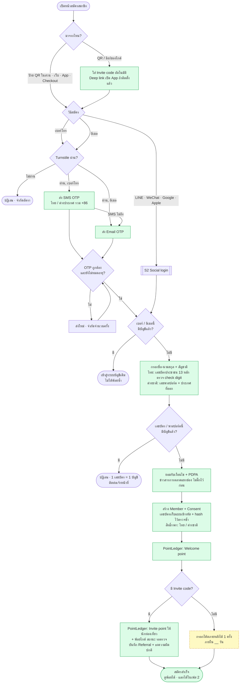
```mermaid
flowchart TD
  entry([เปิดหน้าสมัครสมาชิก]) --> src{มาจากไหน?}
  src -->|QR / ลิงก์ของไกด์| autoinv["ใส่ Invite code อัตโนมัติ<br>Deep link เปิด App ถ้าติดตั้งแล้ว"]
  src -->|ป้าย QR ในสวน · เว็บ · App · Checkout| method
  autoinv --> method{วิธีสมัคร}
  method -->|เบอร์โทร| bot{Turnstile ผ่าน?}
  method -->|อีเมล| bot
  method -->|LINE · WeChat · Google · Apple| social[[S2 Social login]]
  bot -->|ไม่ผ่าน| blocked([ปฏิเสธ · จำกัดอัตรา])
  bot -->|ผ่าน, เบอร์โทร| otp["ส่ง SMS OTP<br>ไทย / ต่างประเทศ รวม +86"]
  bot -->|ผ่าน, อีเมล| eotp[ส่ง Email OTP]
  otp -->|SMS ไม่ถึง| eotp
  otp & eotp --> verify{OTP ถูกต้อง<br>และยังไม่หมดอายุ?}
  verify -->|ไม่| retry[ส่งใหม่ · จำกัดจำนวนครั้ง] --> verify
  verify -->|ใช่| dup
  social --> dup{เบอร์ / อีเมลนี้<br>มีบัญชีแล้ว?}
  dup -->|มี| login(["เข้าสู่ระบบบัญชีเดิม<br>ไม่ได้พ้อยซ้ำ"])
  dup -->|ไม่มี| idd["กรอกชื่อ-นามสกุล + สัญชาติ<br>ไทย: เลขบัตรประชาชน 13 หลัก ตรวจ check digit<br>ต่างชาติ: เลขพาสปอร์ต + ประเทศที่ออก"]
  idd --> iddup{เลขบัตร / พาสปอร์ตนี้<br>มีบัญชีแล้ว?}
  iddup -->|มี| idx(["ปฏิเสธ · 1 เลขบัตร = 1 บัญชี<br>ติดต่อเจ้าหน้าที่"])
  iddup -->|ไม่มี| consent["ยอมรับเงื่อนไข + PDPA<br>ข่าวสารการตลาดแยกช่อง ไม่ติ๊กไว้ก่อน"]
  consent --> create["สร้าง Member + Consent<br>เลขบัตรเก็บแบบเข้ารหัส + hash ไว้ตรวจซ้ำ<br>สิทธิ์ราคา: ไทย / ต่างชาติ"]
  create --> welcome[PointLedger: Welcome point]
  welcome --> hasinv{มี Invite code?}
  hasinv -->|มี| inv["PointLedger: Invite point ให้นักท่องเที่ยว<br>+ พ้อยไกด์ สถานะ รอตรวจ<br>บันทึก Referral + ธงความผิดปกติ"]
  hasinv -->|ไม่มี| later["กรอกโค้ดภายหลังได้ 1 ครั้ง<br>ภายใน __ วัน"]
  inv & later --> done(["สมัครสำเร็จ<br>ดูพ้อยได้ · แลกได้ในเฟส 2"])
  class autoinv,otp,eotp,idd,consent,create,welcome,inv,done p1
  class later assume

  classDef p1 fill:#dcfce7,stroke:#16a34a
  classDef p2 fill:#dbeafe,stroke:#2563eb
  classDef p3 fill:#ffedd5,stroke:#ea580c
  classDef p4 fill:#f3e8ff,stroke:#9333ea
  classDef assume fill:#fef9c3,stroke:#ca8a04,stroke-dasharray:4 3
```

<!-- /diagram -->

#### F2 Agent: บริษัททัวร์และไกด์

<!-- diagram:F2 -->


Mermaid source

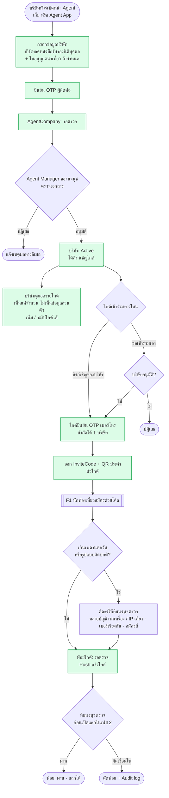
```mermaid
flowchart TD
  c1([บริษัททัวร์เปิดหน้า Agent<br>เว็บ หรือ Agent App]) --> c2["กรอกข้อมูลบริษัท<br>อัปโหลดหนังสือรับรองนิติบุคคล<br>+ ใบอนุญาตนำเที่ยว ถ้ากำหนด"]
  c2 --> c3[ยืนยัน OTP ผู้ติดต่อ] --> c4[AgentCompany: รอตรวจ]
  c4 --> r{Agent Manager ของนงนุช<br>ตรวจเอกสาร}
  r -->|ปฏิเสธ| rj([แจ้งเหตุผลทางอีเมล])
  r -->|อนุมัติ| ok[บริษัท Active<br>ได้ลิงก์เชิญไกด์]
  ok --> dash["บริษัทดูยอดรายไกด์<br>เห็นแค่จำนวน ไม่เห็นข้อมูลส่วนตัว<br>เพิ่ม / ระงับไกด์ได้"]
  ok --> g1{ไกด์เข้าร่วมทางไหน}
  g1 -->|ลิงก์เชิญของบริษัท| g2
  g1 -->|ขอเข้าร่วมเอง| g1b{บริษัทอนุมัติ?}
  g1b -->|ไม่| gx([ปฏิเสธ])
  g1b -->|ใช่| g2["ไกด์ยืนยัน OTP เบอร์โทร<br>สังกัดได้ 1 บริษัท"]
  g2 --> g3[ออก InviteCode + QR ประจำตัวไกด์]
  g3 --> g4[[F1 นักท่องเที่ยวสมัครด้วยโค้ด]]
  g4 --> g5{เกินเพดานต่อวัน<br>หรือรูปแบบผิดปกติ?}
  g5 -->|ใช่| flag["ติดธงให้ทีมนงนุชตรวจ<br>หลายบัญชีจากเครื่อง / IP เดียว · เบอร์เรียงกัน · สมัครถี่"]
  g5 -->|ไม่| pend
  flag --> pend[พ้อยไกด์: รอตรวจ<br>Push แจ้งไกด์]
  pend --> audit{ทีมนงนุชตรวจ<br>ก่อนเปิดแลกในเฟส 2}
  audit -->|ผ่าน| pass([พ้อย: ผ่าน · แลกได้])
  audit -->|ผิดเงื่อนไข| cut([ตัดพ้อย + Audit log])
  class c2,c3,c4,ok,dash,g2,g3,pend p1

  classDef p1 fill:#dcfce7,stroke:#16a34a
  classDef p2 fill:#dbeafe,stroke:#2563eb
  classDef p3 fill:#ffedd5,stroke:#ea580c
  classDef p4 fill:#f3e8ff,stroke:#9333ea
  classDef assume fill:#fef9c3,stroke:#ca8a04,stroke-dasharray:4 3
```

<!-- /diagram -->

#### F3 ซื้อบัตร (Checkout)

<!-- diagram:F3 -->


Mermaid source

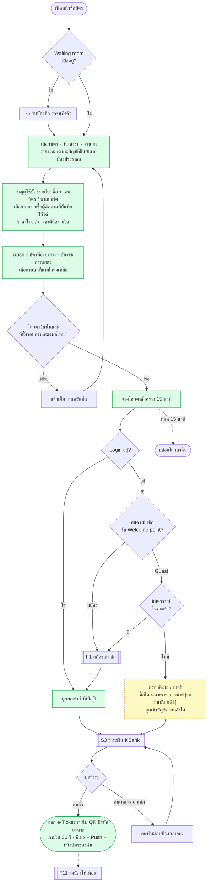
```mermaid
flowchart TD
  start([เปิดหน้าซื้อบัตร]) --> wr{Waiting room<br>เปิดอยู่?}
  wr -->|ใช่| q[[S6 รับบัตรคิว รอจนถึงคิว]] --> sel
  wr -->|ไม่| sel["เลือกบัตร · วันเข้าชม · จำนวน<br>ราคาไทยเฉพาะบัญชีที่ยืนยันเลขบัตรประชาชน"]
  sel --> holder["ระบุผู้ใช้บัตรรายใบ: ชื่อ + เลขบัตร / พาสปอร์ต<br>เลือกจากรายชื่อผู้ติดตามที่บันทึกไว้ได้<br>ราคาไทย / ต่างชาติคิดรายใบ"]
  holder --> up["Upsell: บัตรห้องอาหาร · บัตรชมการแสดง<br>เลือกรอบ เห็นที่นั่งคงเหลือ"]
  up --> inv{โควตาวันนั้นและ<br>ที่นั่งรอบการแสดงพอไหม?}
  inv -->|ไม่พอ| full[แจ้งเต็ม เสนอวันอื่น] --> sel
  inv -->|พอ| hold[จองโควตาชั่วคราว 15 นาที]
  hold --> login{Login อยู่?}
  login -->|ใช่| bind[ผูกออเดอร์กับบัญชี]
  login -->|ไม่| offer{สมัครสมาชิก<br>รับ Welcome point?}
  offer -->|สมัคร| reg[[F1 สมัครสมาชิก]] --> bind
  offer -->|Guest| annual{มีบัตรรายปี<br>ในตะกร้า?}
  annual -->|มี| reg
  annual -->|ไม่มี| guest["กรอกอีเมล / เบอร์<br>ซื้อได้เฉพาะราคาต่างชาติ [รอยืนยัน #31]<br>ผูกเข้าบัญชีภายหลังได้"]
  bind & guest --> pay[[S3 ชำระเงิน KBank]]
  pay --> res{ผลชำระ}
  res -->|สำเร็จ| ok(["ออก e-Ticket รายใบ QR มีรหัสเฉพาะ<br>ภายใน 30 วิ · อีเมล + Push + หน้าบัตรของฉัน"])
  ok -.-> tr[[F11 ส่งบัตรให้เพื่อน]]
  res -->|ล้มเหลว / ยกเลิก| retry[ลองใหม่ภายในเวลาจอง] --> pay
  hold -. หมด 15 นาที .-> release([ปล่อยโควตาคืน])
  class sel,holder,up,hold,bind,guest,ok p1
  class guest assume

  classDef p1 fill:#dcfce7,stroke:#16a34a
  classDef p2 fill:#dbeafe,stroke:#2563eb
  classDef p3 fill:#ffedd5,stroke:#ea580c
  classDef p4 fill:#f3e8ff,stroke:#9333ea
  classDef assume fill:#fef9c3,stroke:#ca8a04,stroke-dasharray:4 3
```

<!-- /diagram -->

#### F4 เข้าประตู

<!-- diagram:F4 -->


Mermaid source

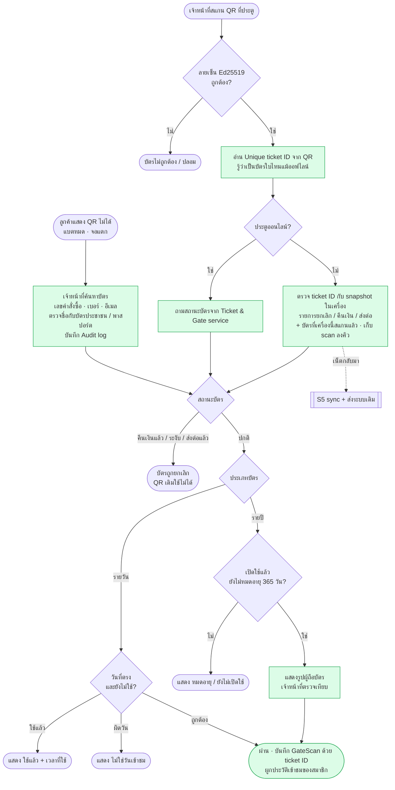
```mermaid
flowchart TD
  s([เจ้าหน้าที่สแกน QR ที่ประตู]) --> sig{ลายเซ็น Ed25519<br>ถูกต้อง?}
  nophone([ลูกค้าแสดง QR ไม่ได้<br>แบตหมด · จอแตก]) --> look["เจ้าหน้าที่ค้นหาบัตร<br>เลขคำสั่งซื้อ · เบอร์ · อีเมล<br>ตรวจชื่อกับบัตรประชาชน / พาสปอร์ต<br>บันทึก Audit log"]
  sig -->|ไม่| bad([บัตรไม่ถูกต้อง / ปลอม])
  sig -->|ใช่| id["อ่าน Unique ticket ID จาก QR<br>รู้ว่าเป็นบัตรใบไหนแม้ออฟไลน์"] --> net{ประตูออนไลน์?}
  net -->|ใช่| api[ถามสถานะบัตรจาก Ticket & Gate service]
  net -->|ไม่| local["ตรวจ ticket ID กับ snapshot ในเครื่อง<br>รายการยกเลิก / คืนเงิน / ส่งต่อ<br>+ บัตรที่เครื่องนี้สแกนแล้ว · เก็บ scan ลงคิว"]
  api & local & look --> st{สถานะบัตร}
  st -->|คืนเงินแล้ว / ระงับ / ส่งต่อแล้ว| void([บัตรถูกยกเลิก<br>QR เดิมใช้ไม่ได้])
  st -->|ปกติ| type{ประเภทบัตร}
  type -->|รายวัน| d1{วันที่ตรง<br>และยังไม่ใช้?}
  d1 -->|ใช้แล้ว| used([แสดง ใช้แล้ว + เวลาที่ใช้])
  d1 -->|ผิดวัน| wrong([แสดง ไม่ใช่วันเข้าชม])
  d1 -->|ถูกต้อง| pass
  type -->|รายปี| a1{เปิดใช้แล้ว<br>ยังไม่หมดอายุ 365 วัน?}
  a1 -->|ไม่| exp([แสดง หมดอายุ / ยังไม่เปิดใช้])
  a1 -->|ใช่| photo[แสดงรูปผู้ถือบัตร<br>เจ้าหน้าที่ตรวจเทียบ] --> pass
  pass(["ผ่าน · บันทึก GateScan ด้วย ticket ID<br>ผูกประวัติเข้าชมของสมาชิก"])
  local -. เน็ตกลับมา .-> sync[[S5 sync + ส่งระบบเดิม]]
  class id,api,local,look,photo,pass p1

  classDef p1 fill:#dcfce7,stroke:#16a34a
  classDef p2 fill:#dbeafe,stroke:#2563eb
  classDef p3 fill:#ffedd5,stroke:#ea580c
  classDef p4 fill:#f3e8ff,stroke:#9333ea
  classDef assume fill:#fef9c3,stroke:#ca8a04,stroke-dasharray:4 3
```

<!-- /diagram -->

#### F5 Workflow อนุมัติ (CMS · ราคา · โปรโมชัน · Agent)

<!-- diagram:F5 -->


Mermaid source

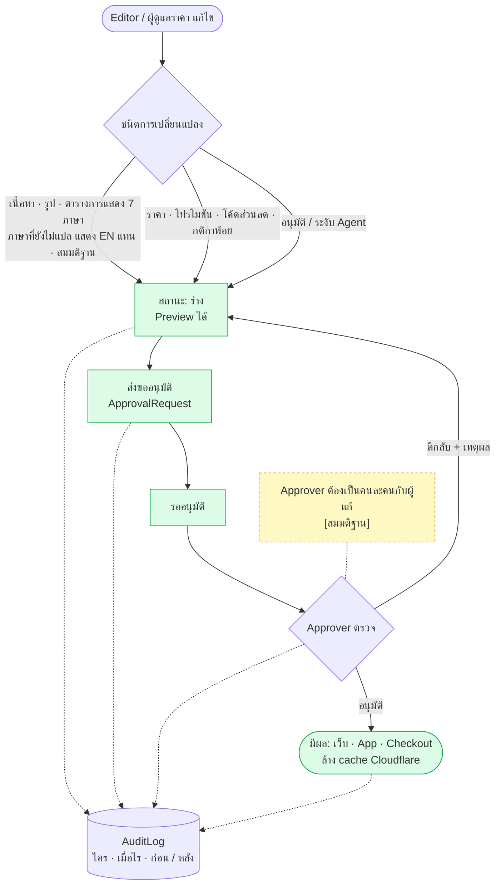
```mermaid
flowchart TD
  e([Editor / ผู้ดูแลราคา แก้ไข]) --> kind{ชนิดการเปลี่ยนแปลง}
  kind -->|เนื้อหา · รูป · ตารางการแสดง 7 ภาษา<br>ภาษาที่ยังไม่แปล แสดง EN แทน · สมมติฐาน| draft
  kind -->|ราคา · โปรโมชัน · โค้ดส่วนลด · กติกาพ้อย| draft
  kind -->|อนุมัติ / ระงับ Agent| draft
  draft[สถานะ: ร่าง<br>Preview ได้] --> submit[ส่งขออนุมัติ<br>ApprovalRequest] --> wait[รออนุมัติ]
  wait --> ap{Approver ตรวจ}
  ap -->|ตีกลับ + เหตุผล| draft
  ap -->|อนุมัติ| pub(["มีผล: เว็บ · App · Checkout<br>ล้าง cache Cloudflare"])
  four["Approver ต้องเป็นคนละคนกับผู้แก้<br>[สมมติฐาน]"] -.- ap
  draft & submit & ap & pub -.-> audit[(AuditLog<br>ใคร · เมื่อไร · ก่อน / หลัง)]
  class draft,submit,wait,pub p1
  class four assume

  classDef p1 fill:#dcfce7,stroke:#16a34a
  classDef p2 fill:#dbeafe,stroke:#2563eb
  classDef p3 fill:#ffedd5,stroke:#ea580c
  classDef p4 fill:#f3e8ff,stroke:#9333ea
  classDef assume fill:#fef9c3,stroke:#ca8a04,stroke-dasharray:4 3
```

<!-- /diagram -->

#### F11 ส่งบัตรให้เพื่อน

<!-- diagram:F11 -->


Mermaid source

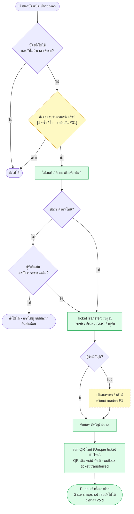
```mermaid
flowchart TD
  a([เจ้าของบัตรเปิด บัตรของฉัน]) --> b{"บัตรยังไม่ใช้<br>และยังไม่ถึงเวลาเข้าชม?"}
  b -->|ไม่| bx([ส่งไม่ได้])
  b -->|ใช่| c{"ส่งต่อครบจำนวนครั้งแล้ว?<br>[1 ครั้ง / ใบ · รอยืนยัน #31]"}
  c -->|ครบ| bx
  c -->|ยัง| d[ใส่เบอร์ / อีเมล หรือสร้างลิงก์]
  d --> e{"บัตรราคาคนไทย?"}
  e -->|ใช่| f{"ผู้รับยืนยัน<br>เลขบัตรประชาชนแล้ว?"}
  f -->|ไม่| fx([ส่งไม่ได้ · แจ้งให้ผู้รับสมัคร / ยืนยันก่อน])
  f -->|ใช่| g
  e -->|ไม่| g["TicketTransfer: รอผู้รับ<br>Push / อีเมล / SMS ถึงผู้รับ"]
  g --> h{"ผู้รับมีบัญชี?"}
  h -->|มี| i[รับบัตรเข้าบัญชีตัวเอง]
  h -->|ไม่มี| j["เปิดบัตรผ่านลิงก์ได้<br>พร้อมชวนสมัคร F1"] --> i
  i --> k["ออก QR ใหม่ (Unique ticket ID ใหม่)<br>QR เดิม void ทันที · outbox ticket.transferred"]
  k --> l(["Push แจ้งทั้งสองฝ่าย<br>Gate snapshot รอบถัดไปได้รายการ void"])
  class d,g,i,k,l p1
  class c,j assume

  classDef p1 fill:#dcfce7,stroke:#16a34a
  classDef p2 fill:#dbeafe,stroke:#2563eb
  classDef p3 fill:#ffedd5,stroke:#ea580c
  classDef p4 fill:#f3e8ff,stroke:#9333ea
  classDef assume fill:#fef9c3,stroke:#ca8a04,stroke-dasharray:4 3
```

<!-- /diagram -->

### เฟส 2

#### F6 ได้พ้อยและแลกพ้อย

<!-- diagram:F6 -->


Mermaid source

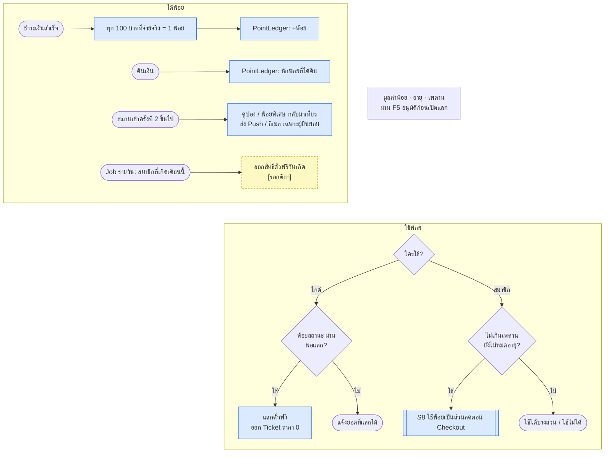
```mermaid
flowchart TD
  subgraph earn[ได้พ้อย]
    sp([ชำระเงินสำเร็จ]) --> calc[ทุก 100 บาทที่จ่ายจริง = 1 พ้อย] --> le[PointLedger: +พ้อย]
    rf([คืนเงิน]) --> rev[PointLedger: หักพ้อยที่ได้คืน]
    ret([สแกนเข้าครั้งที่ 2 ขึ้นไป]) --> promo["คูปอง / พ้อยพิเศษ กลับมาเที่ยว<br>ส่ง Push / อีเมล เฉพาะผู้ยินยอม"]
    bd([Job รายวัน: สมาชิกที่เกิดเดือนนี้]) --> bdt["ออกสิทธิ์ตั๋วฟรีวันเกิด<br>[รอกติกา]"]
  end
  subgraph use[ใช้พ้อย]
    who{ใครใช้?}
    who -->|ไกด์| gchk{พ้อยสถานะ ผ่าน<br>พอแลก?}
    gchk -->|ใช่| gfree["แลกตั๋วฟรี<br>ออก Ticket ราคา 0"]
    gchk -->|ไม่| gno([แจ้งยอดที่แลกได้])
    who -->|สมาชิก| mchk{ไม่เกินเพดาน<br>ยังไม่หมดอายุ?}
    mchk -->|ใช่| disc[[S8 ใช้พ้อยเป็นส่วนลดตอน Checkout]]
    mchk -->|ไม่| mno([ใช้ได้บางส่วน / ใช้ไม่ได้])
  end
  rule["มูลค่าพ้อย · อายุ · เพดาน<br>ผ่าน F5 อนุมัติก่อนเปิดแลก"] -.- who
  class calc,le,rev,promo,gfree,disc p2
  class bdt assume

  classDef p1 fill:#dcfce7,stroke:#16a34a
  classDef p2 fill:#dbeafe,stroke:#2563eb
  classDef p3 fill:#ffedd5,stroke:#ea580c
  classDef p4 fill:#f3e8ff,stroke:#9333ea
  classDef assume fill:#fef9c3,stroke:#ca8a04,stroke-dasharray:4 3
```

<!-- /diagram -->

#### F12 ยกเลิก / เลื่อนวันเข้าชมเอง

<!-- diagram:F12 -->


Mermaid source

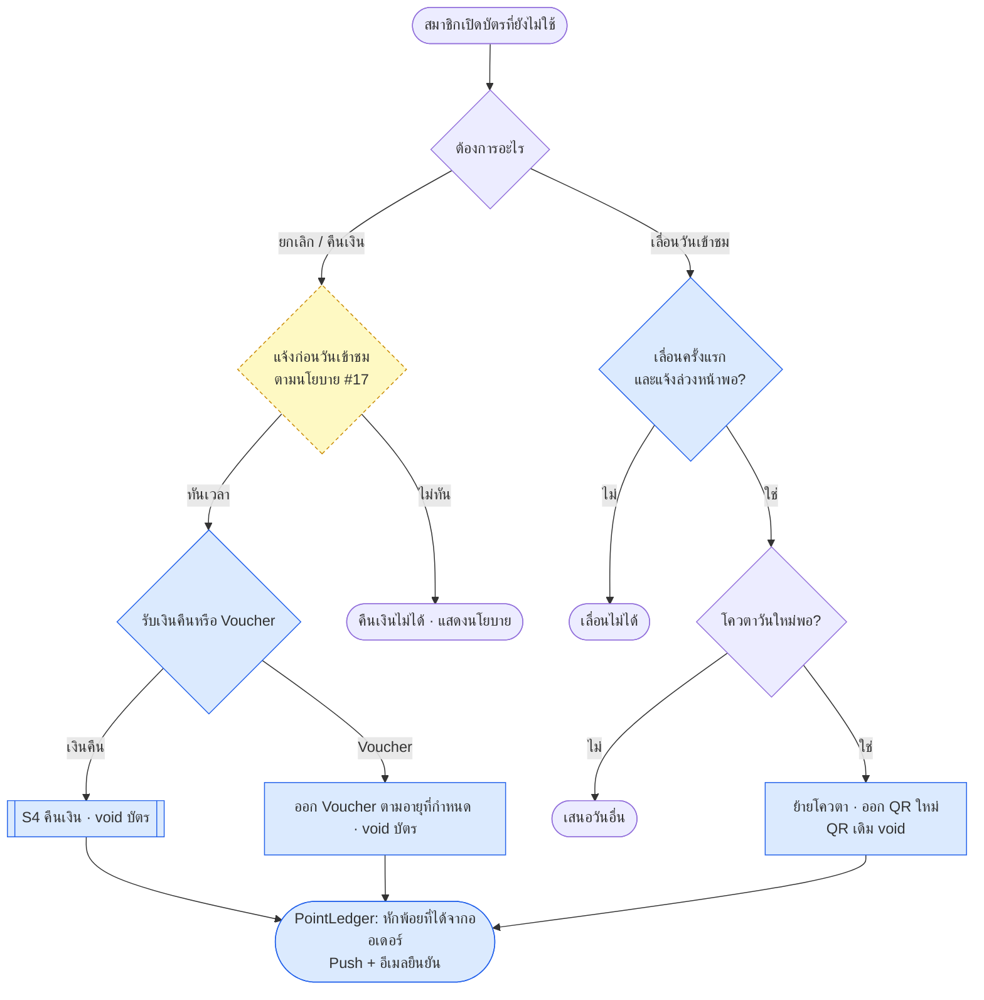
```mermaid
flowchart TD
  a([สมาชิกเปิดบัตรที่ยังไม่ใช้]) --> b{"ต้องการอะไร"}
  b -->|ยกเลิก / คืนเงิน| c{"แจ้งก่อนวันเข้าชม<br>ตามนโยบาย #17"}
  c -->|ทันเวลา| d{"รับเงินคืนหรือ Voucher"}
  d -->|เงินคืน| e[[S4 คืนเงิน · void บัตร]]
  d -->|Voucher| f[ออก Voucher ตามอายุที่กำหนด · void บัตร]
  c -->|ไม่ทัน| x([คืนเงินไม่ได้ · แสดงนโยบาย])
  b -->|เลื่อนวันเข้าชม| g{"เลื่อนครั้งแรก<br>และแจ้งล่วงหน้าพอ?"}
  g -->|ไม่| x2([เลื่อนไม่ได้])
  g -->|ใช่| h{"โควตาวันใหม่พอ?"}
  h -->|ไม่| x3([เสนอวันอื่น])
  h -->|ใช่| i["ย้ายโควตา · ออก QR ใหม่<br>QR เดิม void"]
  e & f & i --> j(["PointLedger: หักพ้อยที่ได้จากออเดอร์<br>Push + อีเมลยืนยัน"])
  class d,e,f,g,i,j p2
  class c assume

  classDef p1 fill:#dcfce7,stroke:#16a34a
  classDef p2 fill:#dbeafe,stroke:#2563eb
  classDef p3 fill:#ffedd5,stroke:#ea580c
  classDef p4 fill:#f3e8ff,stroke:#9333ea
  classDef assume fill:#fef9c3,stroke:#ca8a04,stroke-dasharray:4 3
```

<!-- /diagram -->

### เฟส 3

#### F7 Agent ซื้อบัตรแบบ Bulk

<!-- diagram:F7 -->


Mermaid source

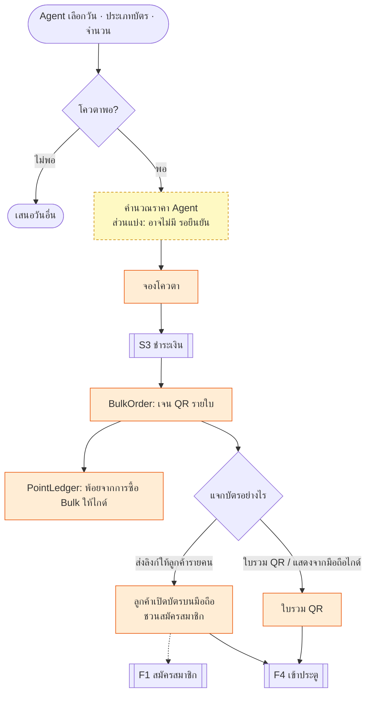
```mermaid
flowchart TD
  a([Agent เลือกวัน · ประเภทบัตร · จำนวน]) --> q{โควตาพอ?}
  q -->|ไม่พอ| alt([เสนอวันอื่น])
  q -->|พอ| price["คำนวณราคา Agent<br>ส่วนแบ่ง: อาจไม่มี รอยืนยัน"]
  price --> hold[จองโควตา] --> pay[[S3 ชำระเงิน]]
  pay --> gen[BulkOrder: เจน QR รายใบ]
  gen --> pts[PointLedger: พ้อยจากการซื้อ Bulk ให้ไกด์]
  gen --> dist{แจกบัตรอย่างไร}
  dist -->|ส่งลิงก์ให้ลูกค้ารายคน| link[ลูกค้าเปิดบัตรบนมือถือ<br>ชวนสมัครสมาชิก]
  dist -->|ใบรวม QR / แสดงจากมือถือไกด์| print[ใบรวม QR]
  link -.-> reg[[F1 สมัครสมาชิก]]
  link & print --> gate[[F4 เข้าประตู]]
  class hold,gen,pts,link,print p3
  class price assume

  classDef p1 fill:#dcfce7,stroke:#16a34a
  classDef p2 fill:#dbeafe,stroke:#2563eb
  classDef p3 fill:#ffedd5,stroke:#ea580c
  classDef p4 fill:#f3e8ff,stroke:#9333ea
  classDef assume fill:#fef9c3,stroke:#ca8a04,stroke-dasharray:4 3
```

<!-- /diagram -->

#### F8 QR event · Voucher · ล่าสมบัติ

<!-- diagram:F8 -->


Mermaid source

```mermaid
flowchart TD
  subgraph ev[QR event และ Voucher]
    e1([สมาชิกสแกน QR ที่ทางเข้า event]) --> e2{ลงทะเบียน event แล้ว<br>และสิทธิ์ยังเหลือ?}
    e2 -->|ยัง| e3[ลงทะเบียนผ่าน App<br>จากปฏิทินกิจกรรม] --> e2
    e2 -->|ใช่| e4[ออก Voucher อาหาร / กิจกรรมฟรี]
    e4 --> e5["ร้านสแกน Voucher<br>ใช้ Gate Scanner app [สมมติฐาน]"] --> e6{ยังไม่ใช้<br>ไม่หมดอายุ?}
    e6 -->|ใช่| e7([ใช้สิทธิ์ · ตัด Voucher])
    e6 -->|ไม่| e8([ปฏิเสธ])
  end
  subgraph ms[ล่าสมบัติ Explorer Passport และ Reward]
    m1([เริ่มภารกิจตามฤดูกาลใน App]) --> m2[สแกนป้าย QR ตามจุดจริง · ชมการแสดง] --> geo{อยู่ในรัศมีของจุด<br>Geofencing?}
    geo -->|ไม่| gx([ไม่นับ · กันโกง])
    geo -->|ใช่| m3{ครบเงื่อนไข?}
    m3 -->|ยัง| m2
    m3 -->|ครบ| m4["PointLedger: แต้มภารกิจ<br>Badge · Leaderboard · Tier"] --> m5["แลก Reward รหัสใช้ครั้งเดียว<br>1 รางวัล / บัญชี / ภารกิจ<br>ของหมด → คูปองชดเชย [รอยืนยัน]"]
  end
  class e3,e4,e7,m2,geo,m4,m5 p3
  class e5 assume

  classDef p1 fill:#dcfce7,stroke:#16a34a
  classDef p2 fill:#dbeafe,stroke:#2563eb
  classDef p3 fill:#ffedd5,stroke:#ea580c
  classDef p4 fill:#f3e8ff,stroke:#9333ea
  classDef assume fill:#fef9c3,stroke:#ca8a04,stroke-dasharray:4 3
```

<!-- /diagram -->

#### F9 Sponsor campaign

<!-- diagram:F9 -->


Mermaid source

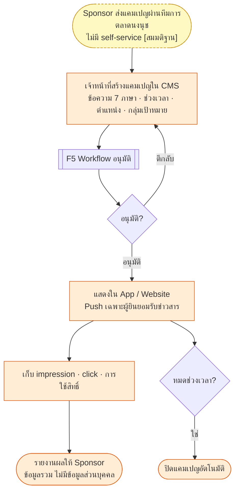
```mermaid
flowchart TD
  s1(["Sponsor ส่งแคมเปญผ่านทีมการตลาดนงนุช<br>ไม่มี self-service [สมมติฐาน]"]) --> s2["เจ้าหน้าที่สร้างแคมเปญใน CMS<br>ข้อความ 7 ภาษา · ช่วงเวลา · ตำแหน่ง · กลุ่มเป้าหมาย"]
  s2 --> s3[[F5 Workflow อนุมัติ]] --> s4{อนุมัติ?}
  s4 -->|ตีกลับ| s2
  s4 -->|อนุมัติ| s5["แสดงใน App / Website<br>Push เฉพาะผู้ยินยอมรับข่าวสาร"]
  s5 --> s6[เก็บ impression · click · การใช้สิทธิ์]
  s6 --> s7(["รายงานผลให้ Sponsor<br>ข้อมูลรวม ไม่มีข้อมูลส่วนบุคคล"])
  s5 --> s8{หมดช่วงเวลา?}
  s8 -->|ใช่| s9([ปิดแคมเปญอัตโนมัติ])
  class s2,s5,s6,s7,s9 p3
  class s1 assume

  classDef p1 fill:#dcfce7,stroke:#16a34a
  classDef p2 fill:#dbeafe,stroke:#2563eb
  classDef p3 fill:#ffedd5,stroke:#ea580c
  classDef p4 fill:#f3e8ff,stroke:#9333ea
  classDef assume fill:#fef9c3,stroke:#ca8a04,stroke-dasharray:4 3
```

<!-- /diagram -->

### เฟส 4

#### F10 Partner · ของฝาก (รับที่ร้าน / ส่งถึงบ้าน) · โรงแรม / MICE

<!-- diagram:F10 -->


Mermaid source

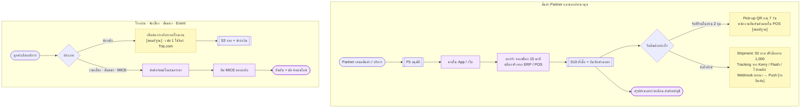
```mermaid
flowchart TD
  subgraph pt[สินค้า Partner และของฝากนงนุช]
    p1([Partner เสนอสินค้า / บริการ]) --> p2[[F5 อนุมัติ]] --> p3[ขายใน App / เว็บ]
    p3 --> cart["ตะกร้า จองสต็อก 15 นาที<br>สต็อกจริงจาก ERP / POS"] --> p4[[S10 สั่งซื้อ + บันทึกส่วนแบ่ง]] --> p5{รับสินค้าอย่างไร}
    p5 -->|รับที่ร้านในสวน 2 จุด| p6["Pick-up QR อายุ 7 วัน<br>พนักงานยืนยันส่งมอบใน POS [สมมติฐาน]"]
    p5 -->|ส่งถึงบ้าน| p7["Shipment: 50 บาท ฟรีเมื่อครบ 1,000<br>Tracking จาก Kerry / Flash / ไปรษณีย์<br>Webhook สถานะ → Push [รอยืนยัน]"]
    p4 --> p8([สรุปส่วนแบ่งรายเดือน ส่งฝ่ายบัญชี])
  end
  subgraph ht[โรงแรม · จัดเลี้ยง · สัมมนา · Event]
    h1([ลูกค้าเลือกบริการ]) --> h2{ประเภท}
    h2 -->|ห้องพัก| h3["เช็คห้องว่างกับระบบโรงแรม<br>[สมมติฐาน] · เฟส 1 ใช้ลิงก์ Trip.com"]
    h3 --> h4[[S3 จอง + ชำระเงิน]]
    h2 -->|งานเลี้ยง · สัมมนา · MICE| h5[ส่งฟอร์มขอใบเสนอราคา] --> h6[ทีม MICE ตอบกลับ] --> h7([ยืนยัน + มัดจำออนไลน์])
  end
  class p3,cart,p8,h5,h6,h7 p4
  class p6,p7,h3 assume

  classDef p1 fill:#dcfce7,stroke:#16a34a
  classDef p2 fill:#dbeafe,stroke:#2563eb
  classDef p3 fill:#ffedd5,stroke:#ea580c
  classDef p4 fill:#f3e8ff,stroke:#9333ea
  classDef assume fill:#fef9c3,stroke:#ca8a04,stroke-dasharray:4 3
```

<!-- /diagram -->

---

## 4. Sequence Diagram

### เฟส 1

#### S1 สมัครด้วย OTP + Invite code → Point Ledger

<!-- diagram:S1 -->
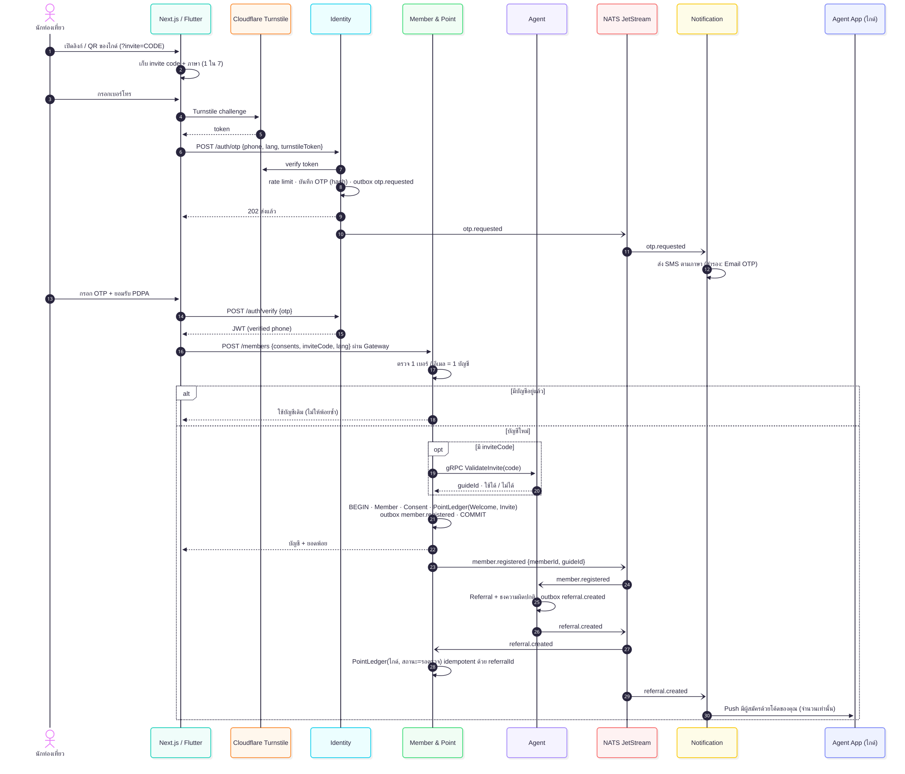

Mermaid source

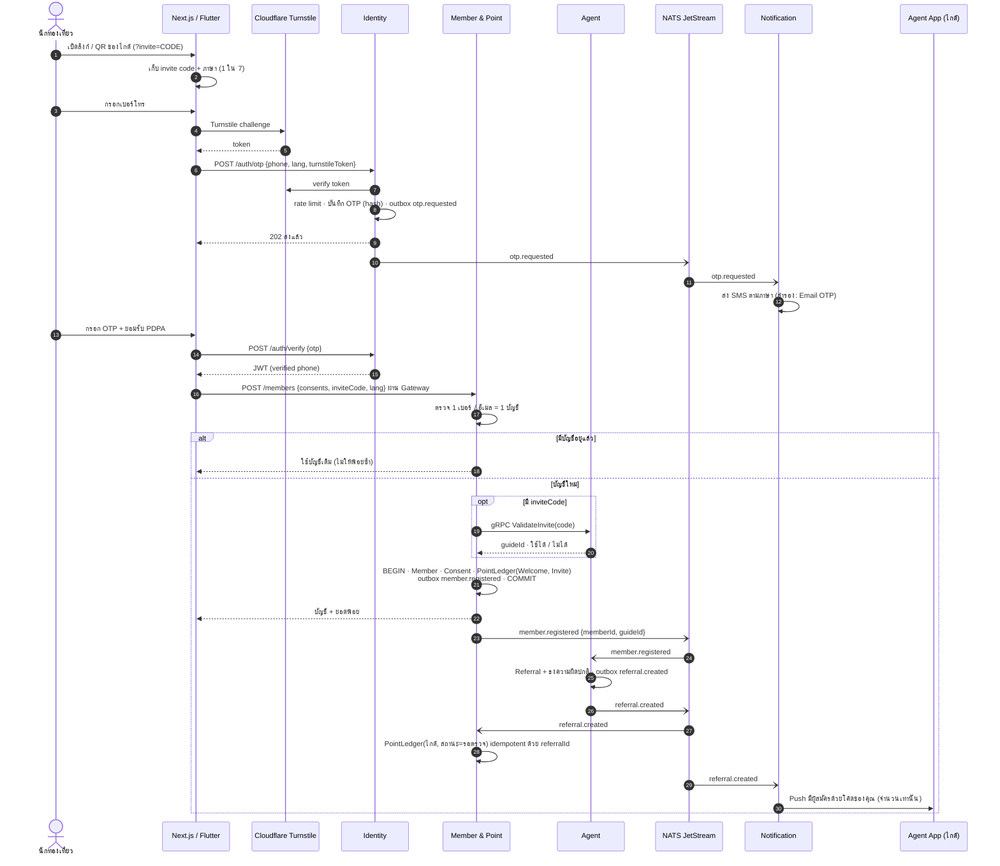
```mermaid
sequenceDiagram
  autonumber
  actor T as นักท่องเที่ยว
  participant FE as Next.js / Flutter
  participant CF as Cloudflare Turnstile
  participant ID as Identity
  participant MP as Member & Point
  participant AG as Agent
  participant NB as NATS JetStream
  participant NT as Notification
  participant G as Agent App (ไกด์)

  T->>FE: เปิดลิงก์ / QR ของไกด์ (?invite=CODE)
  FE->>FE: เก็บ invite code + ภาษา (1 ใน 7)
  T->>FE: กรอกเบอร์โทร
  FE->>CF: Turnstile challenge
  CF-->>FE: token
  FE->>ID: POST /auth/otp {phone, lang, turnstileToken}
  ID->>CF: verify token
  ID->>ID: rate limit · บันทึก OTP (hash) · outbox otp.requested
  ID-->>FE: 202 ส่งแล้ว
  ID-)NB: otp.requested
  NB-)NT: otp.requested
  NT->>NT: ส่ง SMS ตามภาษา (สำรอง: Email OTP)
  T->>FE: กรอก OTP + ยอมรับ PDPA
  FE->>ID: POST /auth/verify {otp}
  ID-->>FE: JWT (verified phone)
  FE->>MP: POST /members {consents, inviteCode, lang} ผ่าน Gateway
  MP->>MP: ตรวจ 1 เบอร์ / อีเมล = 1 บัญชี
  alt มีบัญชีอยู่แล้ว
    MP-->>FE: ใช้บัญชีเดิม (ไม่ให้พ้อยซ้ำ)
  else บัญชีใหม่
    opt มี inviteCode
      MP->>AG: gRPC ValidateInvite(code)
      AG-->>MP: guideId · ใช้ได้ / ไม่ได้
    end
    MP->>MP: BEGIN · Member · Consent · PointLedger(Welcome, Invite)<br>outbox member.registered · COMMIT
    MP-->>FE: บัญชี + ยอดพ้อย
    MP-)NB: member.registered {memberId, guideId}
    NB-)AG: member.registered
    AG->>AG: Referral + ธงความผิดปกติ · outbox referral.created
    AG-)NB: referral.created
    NB-)MP: referral.created
    MP->>MP: PointLedger(ไกด์, สถานะ=รอตรวจ) idempotent ด้วย referralId
    NB-)NT: referral.created
    NT->>G: Push มีผู้สมัครด้วยโค้ดของคุณ (จำนวนเท่านั้น)
  end
```

<!-- /diagram -->

#### S2 Social login และการผูกบัญชี

<!-- diagram:S2 -->
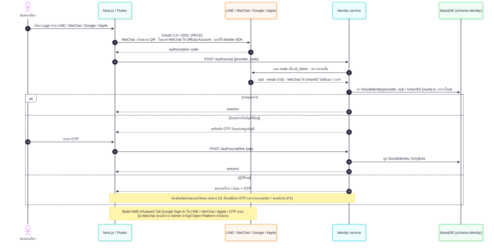

Mermaid source

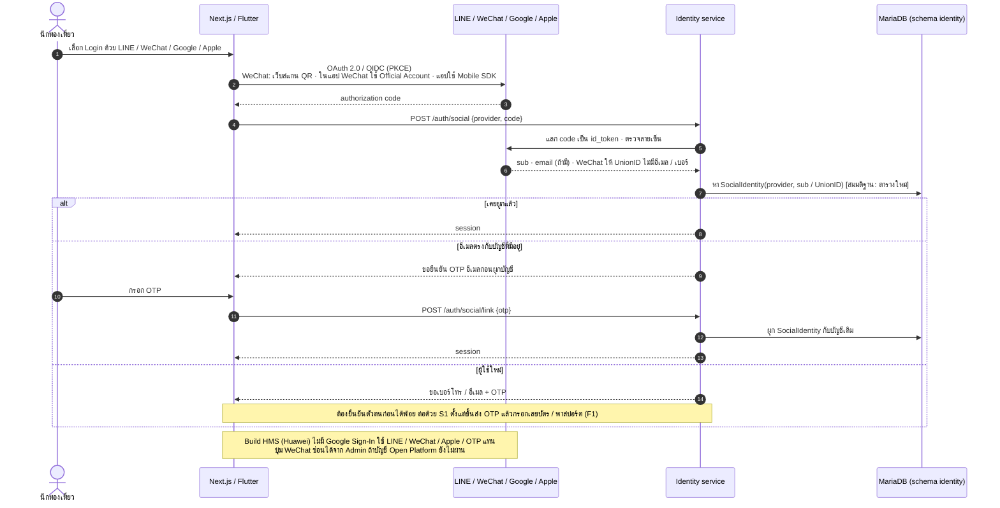
```mermaid
sequenceDiagram
  autonumber
  actor T as นักท่องเที่ยว
  participant FE as Next.js / Flutter
  participant IdP as LINE / WeChat / Google / Apple
  participant API as Identity service
  participant DB as MariaDB (schema identity)

  T->>FE: เลือก Login ด้วย LINE / WeChat / Google / Apple
  FE->>IdP: OAuth 2.0 / OIDC (PKCE)<br>WeChat: เว็บสแกน QR · ในแอป WeChat ใช้ Official Account · แอปใช้ Mobile SDK
  IdP-->>FE: authorization code
  FE->>API: POST /auth/social {provider, code}
  API->>IdP: แลก code เป็น id_token · ตรวจลายเซ็น
  IdP-->>API: sub · email (ถ้ามี) · WeChat ให้ UnionID ไม่มีอีเมล / เบอร์
  API->>DB: หา SocialIdentity(provider, sub / UnionID) [สมมติฐาน: ตารางใหม่]
  alt เคยผูกแล้ว
    API-->>FE: session
  else อีเมลตรงกับบัญชีที่มีอยู่
    API-->>FE: ขอยืนยัน OTP อีเมลก่อนผูกบัญชี
    T->>FE: กรอก OTP
    FE->>API: POST /auth/social/link {otp}
    API->>DB: ผูก SocialIdentity กับบัญชีเดิม
    API-->>FE: session
  else ผู้ใช้ใหม่
    API-->>FE: ขอเบอร์โทร / อีเมล + OTP
    Note over FE,API: ต้องยืนยันตัวตนก่อนได้พ้อย ต่อด้วย S1 ตั้งแต่ขั้นส่ง OTP แล้วกรอกเลขบัตร / พาสปอร์ต (F1)
  end
  Note over FE,IdP: Build HMS (Huawei) ไม่มี Google Sign-In ใช้ LINE / WeChat / Apple / OTP แทน<br>ปุ่ม WeChat ซ่อนได้จาก Admin ถ้าบัญชี Open Platform ยังไม่ผ่าน
```

<!-- /diagram -->

#### S3 Checkout → KBank → Webhook → e-Ticket

<!-- diagram:S3 -->
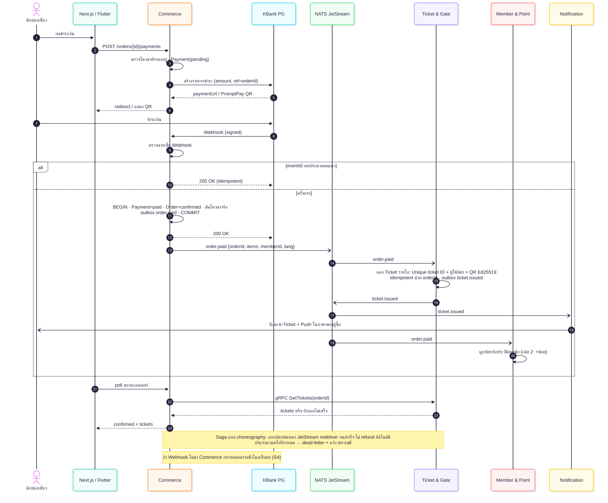

Mermaid source

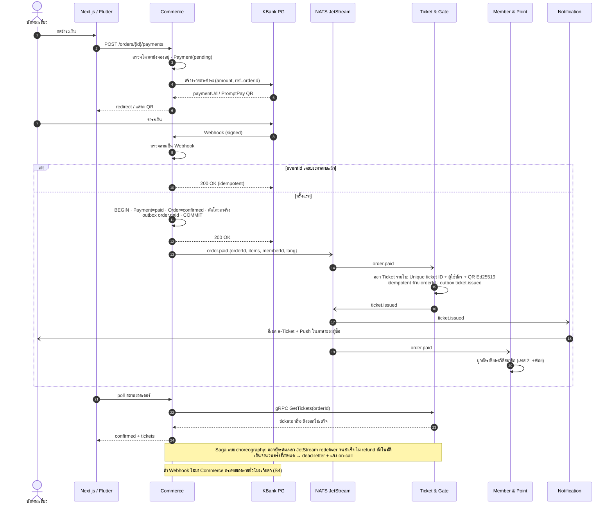
```mermaid
sequenceDiagram
  autonumber
  actor T as นักท่องเที่ยว
  participant FE as Next.js / Flutter
  participant CO as Commerce
  participant KB as KBank PG
  participant NB as NATS JetStream
  participant TG as Ticket & Gate
  participant MP as Member & Point
  participant NT as Notification

  T->>FE: กดชำระเงิน
  FE->>CO: POST /orders/{id}/payments
  CO->>CO: ตรวจโควตายังจองอยู่ · Payment(pending)
  CO->>KB: สร้างรายการชำระ (amount, ref=orderId)
  KB-->>CO: paymentUrl / PromptPay QR
  CO-->>FE: redirect / แสดง QR
  T->>KB: ชำระเงิน
  KB->>CO: Webhook (signed)
  CO->>CO: ตรวจลายเซ็น Webhook
  alt eventId เคยประมวลผลแล้ว
    CO-->>KB: 200 OK (idempotent)
  else ครั้งแรก
    CO->>CO: BEGIN · Payment=paid · Order=confirmed · ตัดโควตาจริง<br>outbox order.paid · COMMIT
    CO-->>KB: 200 OK
    CO-)NB: order.paid {orderId, items, memberId, lang}
    NB-)TG: order.paid
    TG->>TG: ออก Ticket รายใบ: Unique ticket ID + ผู้ใช้บัตร + QR Ed25519<br>idempotent ด้วย orderId · outbox ticket.issued
    TG-)NB: ticket.issued
    NB-)NT: ticket.issued
    NT-)T: อีเมล e-Ticket + Push ในภาษาของผู้ซื้อ
    NB-)MP: order.paid
    MP->>MP: ผูกบัตรกับประวัติสมาชิก (เฟส 2: +พ้อย)
  end
  FE->>CO: poll สถานะออเดอร์
  CO->>TG: gRPC GetTickets(orderId)
  TG-->>CO: tickets หรือ ยังออกไม่เสร็จ
  CO-->>FE: confirmed + tickets
  Note over CO,TG: Saga แบบ choreography: ออกบัตรล้มเหลว JetStream redeliver จนสำเร็จ ไม่ refund อัตโนมัติ<br>เกินจำนวนครั้งที่กำหนด → dead-letter + แจ้ง on-call
  Note over CO,KB: ถ้า Webhook ไม่มา Commerce กระทบยอดรายชั่วโมงเก็บตก (S4)
```

<!-- /diagram -->

#### S4 กระทบยอดรายชั่วโมง และคืนเงิน

<!-- diagram:S4 -->
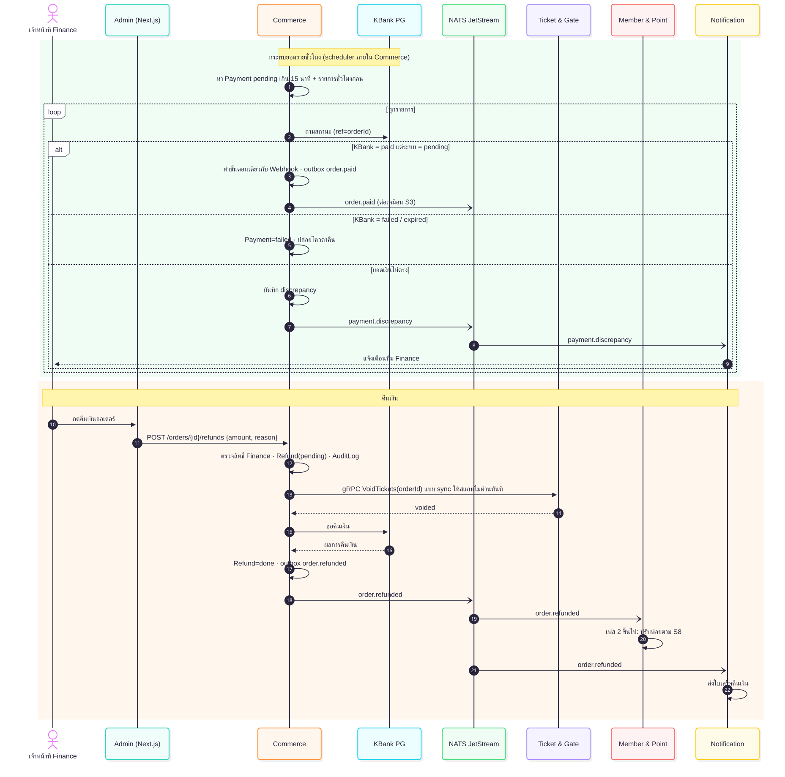

Mermaid source

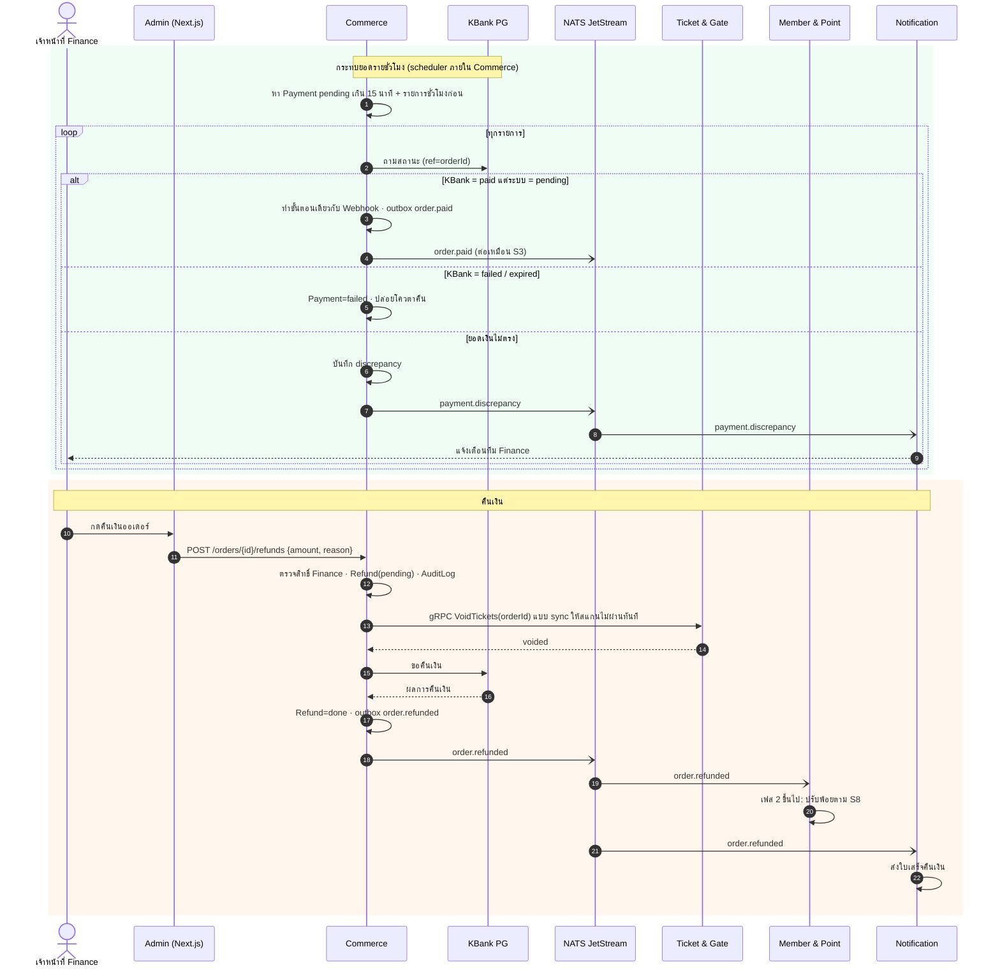
```mermaid
sequenceDiagram
  autonumber
  actor F as เจ้าหน้าที่ Finance
  participant AD as Admin (Next.js)
  participant CO as Commerce
  participant KB as KBank PG
  participant NB as NATS JetStream
  participant TG as Ticket & Gate
  participant MP as Member & Point
  participant NT as Notification

  rect rgb(240, 253, 244)
    Note over CO,KB: กระทบยอดรายชั่วโมง (scheduler ภายใน Commerce)
    CO->>CO: หา Payment pending เกิน 15 นาที + รายการชั่วโมงก่อน
    loop ทุกรายการ
      CO->>KB: ถามสถานะ (ref=orderId)
      alt KBank = paid แต่ระบบ = pending
        CO->>CO: ทำขั้นตอนเดียวกับ Webhook · outbox order.paid
        CO-)NB: order.paid (ต่อเหมือน S3)
      else KBank = failed / expired
        CO->>CO: Payment=failed · ปล่อยโควตาคืน
      else ยอดเงินไม่ตรง
        CO->>CO: บันทึก discrepancy
        CO-)NB: payment.discrepancy
        NB-)NT: payment.discrepancy
        NT-->>F: แจ้งเตือนทีม Finance
      end
    end
  end

  rect rgb(255, 247, 237)
    Note over F,NT: คืนเงิน
    F->>AD: กดคืนเงินออเดอร์
    AD->>CO: POST /orders/{id}/refunds {amount, reason}
    CO->>CO: ตรวจสิทธิ์ Finance · Refund(pending) · AuditLog
    CO->>TG: gRPC VoidTickets(orderId) แบบ sync ให้สแกนไม่ผ่านทันที
    TG-->>CO: voided
    CO->>KB: ขอคืนเงิน
    KB-->>CO: ผลการคืนเงิน
    CO->>CO: Refund=done · outbox order.refunded
    CO-)NB: order.refunded
    NB-)MP: order.refunded
    MP->>MP: เฟส 2 ขึ้นไป: ปรับพ้อยตาม S8
    NB-)NT: order.refunded
    NT->>NT: ส่งใบเสร็จคืนเงิน
  end
```

<!-- /diagram -->

#### S5 สแกนประตู online / offline + sync ระบบเดิม

<!-- diagram:S5 -->
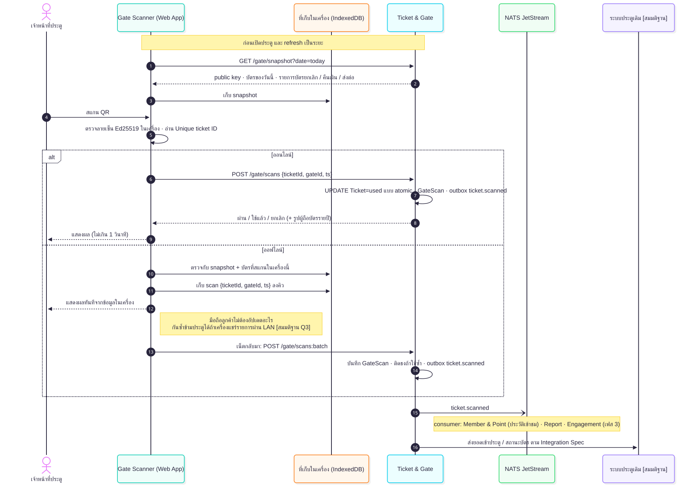

Mermaid source

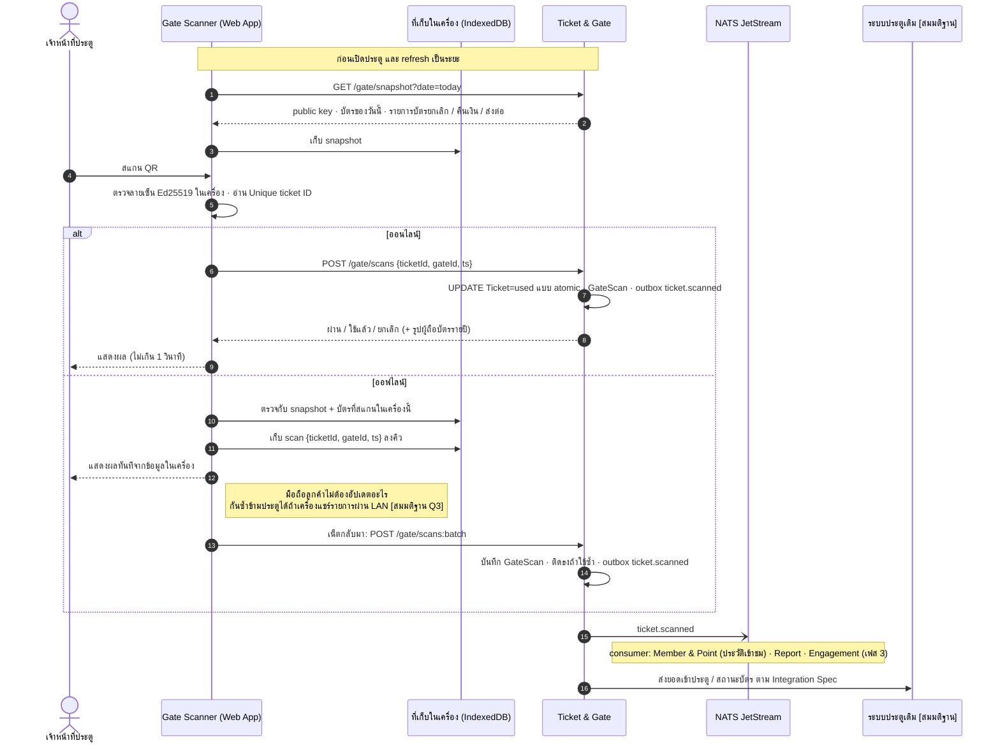
```mermaid
sequenceDiagram
  autonumber
  actor S as เจ้าหน้าที่ประตู
  participant GS as Gate Scanner (Web App)
  participant LS as ที่เก็บในเครื่อง (IndexedDB)
  participant TG as Ticket & Gate
  participant NB as NATS JetStream
  participant LG as ระบบประตูเดิม [สมมติฐาน]

  Note over GS,TG: ก่อนเปิดประตู และ refresh เป็นระยะ
  GS->>TG: GET /gate/snapshot?date=today
  TG-->>GS: public key · บัตรของวันนี้ · รายการบัตรยกเลิก / คืนเงิน / ส่งต่อ
  GS->>LS: เก็บ snapshot
  S->>GS: สแกน QR
  GS->>GS: ตรวจลายเซ็น Ed25519 ในเครื่อง · อ่าน Unique ticket ID
  alt ออนไลน์
    GS->>TG: POST /gate/scans {ticketId, gateId, ts}
    TG->>TG: UPDATE Ticket=used แบบ atomic · GateScan · outbox ticket.scanned
    TG-->>GS: ผ่าน / ใช้แล้ว / ยกเลิก (+ รูปผู้ถือบัตรรายปี)
    GS-->>S: แสดงผล (ไม่เกิน 1 วินาที)
  else ออฟไลน์
    GS->>LS: ตรวจกับ snapshot + บัตรที่สแกนในเครื่องนี้
    GS->>LS: เก็บ scan {ticketId, gateId, ts} ลงคิว
    GS-->>S: แสดงผลทันทีจากข้อมูลในเครื่อง
    Note right of GS: มือถือลูกค้าไม่ต้องอัปเดตอะไร<br>กันซ้ำข้ามประตูได้ถ้าเครื่องแชร์รายการผ่าน LAN [สมมติฐาน Q3]
    GS->>TG: เน็ตกลับมา: POST /gate/scans:batch
    TG->>TG: บันทึก GateScan · ติดธงถ้าใช้ซ้ำ · outbox ticket.scanned
  end
  TG-)NB: ticket.scanned
  Note over NB: consumer: Member & Point (ประวัติเข้าชม) · Report · Engagement (เฟส 3)
  TG->>LG: ส่งยอดเข้าประตู / สถานะบัตร ตาม Integration Spec
```

<!-- /diagram -->

#### S6 Waiting room

<!-- diagram:S6 -->
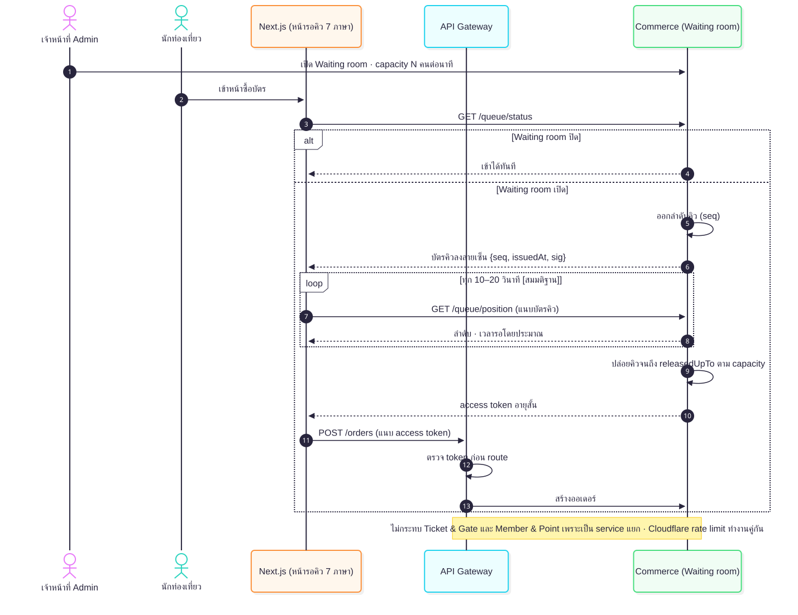

Mermaid source

```mermaid
sequenceDiagram
  autonumber
  actor A as เจ้าหน้าที่ Admin
  actor T as นักท่องเที่ยว
  participant FE as Next.js (หน้ารอคิว 7 ภาษา)
  participant GW as API Gateway
  participant CO as Commerce (Waiting room)

  A->>CO: เปิด Waiting room · capacity N คนต่อนาที
  T->>FE: เข้าหน้าซื้อบัตร
  FE->>CO: GET /queue/status
  alt Waiting room ปิด
    CO-->>FE: เข้าได้ทันที
  else Waiting room เปิด
    CO->>CO: ออกลำดับคิว (seq)
    CO-->>FE: บัตรคิวลงลายเซ็น {seq, issuedAt, sig}
    loop ทุก 10–20 วินาที [สมมติฐาน]
      FE->>CO: GET /queue/position (แนบบัตรคิว)
      CO-->>FE: ลำดับ · เวลารอโดยประมาณ
    end
    CO->>CO: ปล่อยคิวจนถึง releasedUpTo ตาม capacity
    CO-->>FE: access token อายุสั้น
    FE->>GW: POST /orders (แนบ access token)
    GW->>GW: ตรวจ token ก่อน route
    GW->>CO: สร้างออเดอร์
  end
  Note over GW,CO: ไม่กระทบ Ticket & Gate และ Member & Point เพราะเป็น service แยก · Cloudflare rate limit ทำงานคู่กัน
```

<!-- /diagram -->

#### S7 Push notification routing (App + Web Push นอกแอป)

<!-- diagram:S7 -->
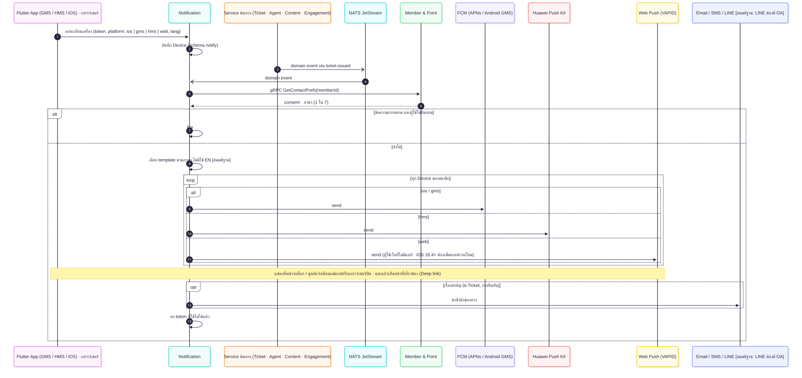

Mermaid source

```mermaid
sequenceDiagram
  autonumber
  participant App as Flutter App (GMS / HMS / iOS) · เบราว์เซอร์
  participant NT as Notification
  participant SRC as Service ต้นทาง (Ticket · Agent · Content · Engagement)
  participant NB as NATS JetStream
  participant MP as Member & Point
  participant FCM as FCM (APNs / Android GMS)
  participant HPK as Huawei Push Kit
  participant WP as Web Push (VAPID)
  participant BK as Email / SMS / LINE [สมมติฐาน: LINE ต้องมี OA]

  App->>NT: ลงทะเบียนเครื่อง {token, platform: ios | gms | hms | web, lang}
  NT->>NT: บันทึก Device (schema notify)
  SRC-)NB: domain event เช่น ticket.issued
  NB-)NT: domain event
  NT->>MP: gRPC GetContactPrefs(memberId)
  MP-->>NT: consent · ภาษา (1 ใน 7)
  alt ข้อความการตลาด และผู้ใช้ไม่ยินยอม
    NT->>NT: ข้าม
  else ส่งได้
    NT->>NT: เลือก template ตามภาษา ไม่มีใช้ EN [สมมติฐาน]
    loop ทุก Device ของสมาชิก
      alt ios / gms
        NT->>FCM: send
      else hms
        NT->>HPK: send
      else web
        NT->>WP: send (ผู้ใช้เว็บที่ไม่มีแอป · iOS 16.4+ ต้องเพิ่มลงหน้าจอโฮม)
      end
    end
    Note over App,WP: แสดงที่หน้าจอล็อก / ศูนย์แจ้งเตือนแม้แอปหรือเบราว์เซอร์ปิด · แตะแล้วเปิดหน้าที่เกี่ยวข้อง (Deep link)
    opt เรื่องสำคัญ (e-Ticket, การยืนยัน)
      NT->>BK: ส่งซ้ำอีกช่องทาง
    end
    NT->>NT: ลบ token ที่ใช้ไม่ได้แล้ว
  end
```

<!-- /diagram -->

### เฟส 2

#### S8 ใช้พ้อยเป็นส่วนลด + ปรับพ้อยเมื่อคืนเงิน

<!-- diagram:S8 -->
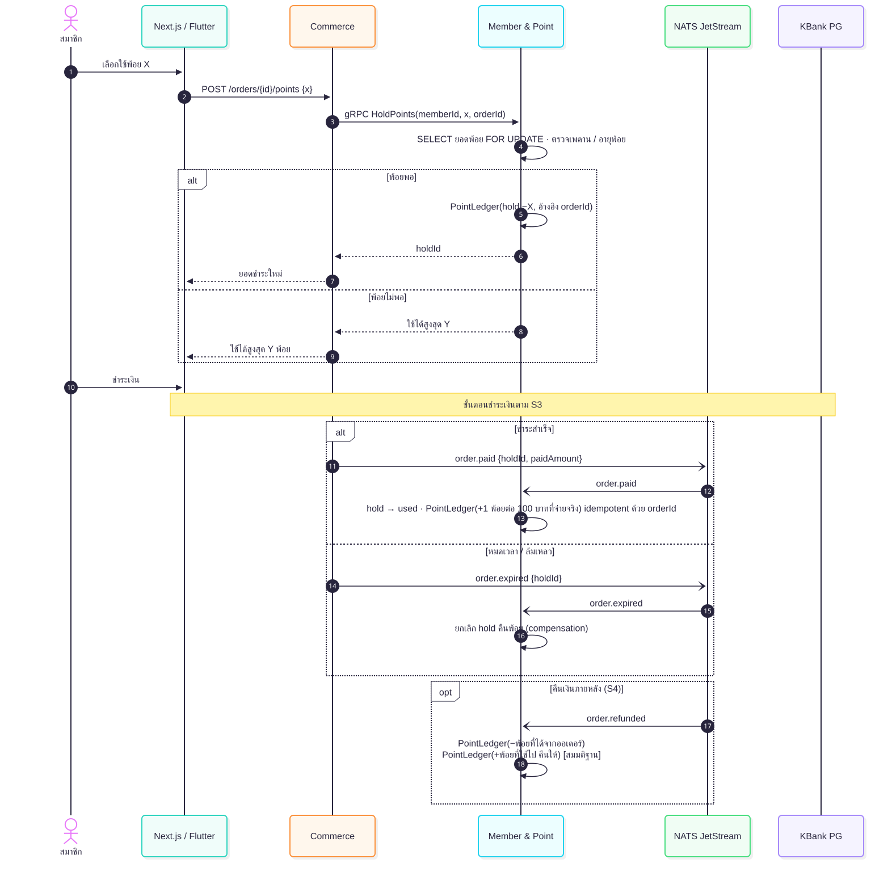

Mermaid source

```mermaid
sequenceDiagram
  autonumber
  actor T as สมาชิก
  participant FE as Next.js / Flutter
  participant CO as Commerce
  participant MP as Member & Point
  participant NB as NATS JetStream
  participant KB as KBank PG

  T->>FE: เลือกใช้พ้อย X
  FE->>CO: POST /orders/{id}/points {x}
  CO->>MP: gRPC HoldPoints(memberId, x, orderId)
  MP->>MP: SELECT ยอดพ้อย FOR UPDATE · ตรวจเพดาน / อายุพ้อย
  alt พ้อยพอ
    MP->>MP: PointLedger(hold −X, อ้างอิง orderId)
    MP-->>CO: holdId
    CO-->>FE: ยอดชำระใหม่
  else พ้อยไม่พอ
    MP-->>CO: ใช้ได้สูงสุด Y
    CO-->>FE: ใช้ได้สูงสุด Y พ้อย
  end
  T->>FE: ชำระเงิน
  Note over FE,KB: ขั้นตอนชำระเงินตาม S3
  alt ชำระสำเร็จ
    CO-)NB: order.paid {holdId, paidAmount}
    NB-)MP: order.paid
    MP->>MP: hold → used · PointLedger(+1 พ้อยต่อ 100 บาทที่จ่ายจริง) idempotent ด้วย orderId
  else หมดเวลา / ล้มเหลว
    CO-)NB: order.expired {holdId}
    NB-)MP: order.expired
    MP->>MP: ยกเลิก hold คืนพ้อย (compensation)
  end
  opt คืนเงินภายหลัง (S4)
    NB-)MP: order.refunded
    MP->>MP: PointLedger(−พ้อยที่ได้จากออเดอร์)<br>PointLedger(+พ้อยที่ใช้ไป คืนให้) [สมมติฐาน]
  end
```

<!-- /diagram -->

### เฟส 4

#### S9 Scan จ่ายเงินในสวน

<!-- diagram:S9 -->
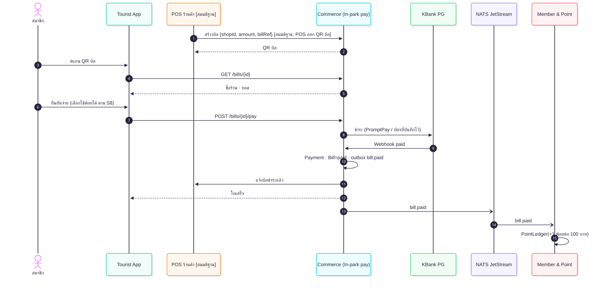

Mermaid source

```mermaid
sequenceDiagram
  autonumber
  actor T as สมาชิก
  participant App as Tourist App
  participant POS as POS ร้านค้า [สมมติฐาน]
  participant CO as Commerce (In-park pay)
  participant KB as KBank PG
  participant NB as NATS JetStream
  participant MP as Member & Point

  POS->>CO: สร้างบิล {shopId, amount, billRef} [สมมติฐาน: POS ออก QR บิล]
  CO-->>POS: QR บิล
  T->>App: สแกน QR บิล
  App->>CO: GET /bills/{id}
  CO-->>App: ชื่อร้าน · ยอด
  T->>App: ยืนยันจ่าย (เลือกใช้พ้อยได้ ตาม S8)
  App->>CO: POST /bills/{id}/pay
  CO->>KB: ชำระ (PromptPay / บัตรที่บันทึกไว้)
  KB->>CO: Webhook paid
  CO->>CO: Payment · Bill=paid · outbox bill.paid
  CO->>POS: แจ้งบิลชำระแล้ว
  CO-->>App: ใบเสร็จ
  CO-)NB: bill.paid
  NB-)MP: bill.paid
  MP->>MP: PointLedger(+1 พ้อยต่อ 100 บาท)
```

<!-- /diagram -->

#### S10 สั่งซื้อสินค้า Partner + ส่วนแบ่งรายได้

<!-- diagram:S10 -->
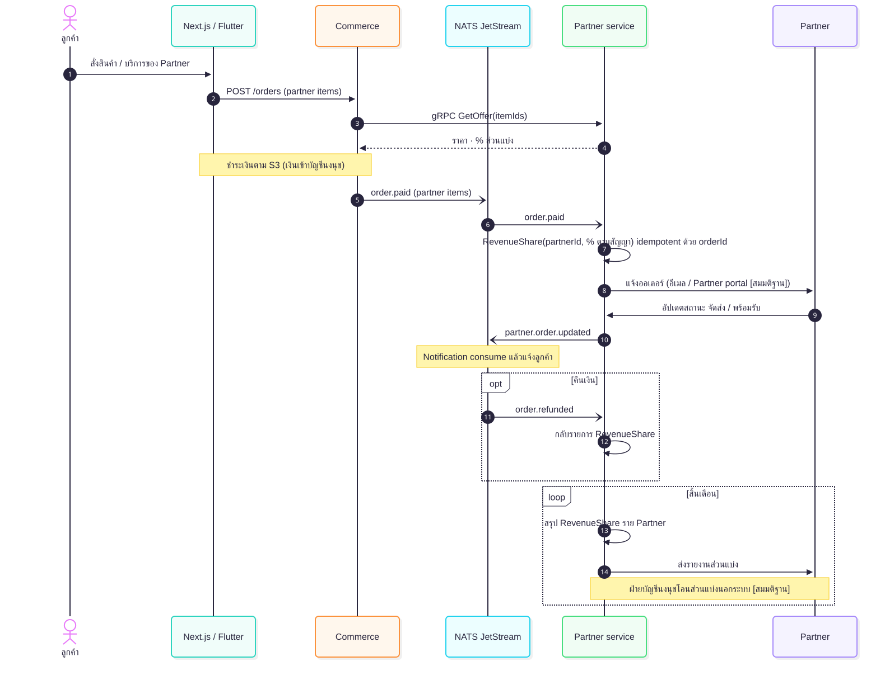

Mermaid source

```mermaid
sequenceDiagram
  autonumber
  actor T as ลูกค้า
  participant FE as Next.js / Flutter
  participant CO as Commerce
  participant NB as NATS JetStream
  participant PT as Partner service
  participant P as Partner

  T->>FE: สั่งสินค้า / บริการของ Partner
  FE->>CO: POST /orders (partner items)
  CO->>PT: gRPC GetOffer(itemIds)
  PT-->>CO: ราคา · % ส่วนแบ่ง
  Note over FE,CO: ชำระเงินตาม S3 (เงินเข้าบัญชีนงนุช)
  CO-)NB: order.paid (partner items)
  NB-)PT: order.paid
  PT->>PT: RevenueShare(partnerId, % ตามสัญญา) idempotent ด้วย orderId
  PT->>P: แจ้งออเดอร์ (อีเมล / Partner portal [สมมติฐาน])
  P->>PT: อัปเดตสถานะ จัดส่ง / พร้อมรับ
  PT-)NB: partner.order.updated
  Note over NB: Notification consume แล้วแจ้งลูกค้า
  opt คืนเงิน
    NB-)PT: order.refunded
    PT->>PT: กลับรายการ RevenueShare
  end
  loop สิ้นเดือน
    PT->>PT: สรุป RevenueShare ราย Partner
    PT->>P: ส่งรายงานส่วนแบ่ง
    Note over PT,P: ฝ่ายบัญชีนงนุชโอนส่วนแบ่งนอกระบบ [สมมติฐาน]
  end
```

<!-- /diagram -->

---

## 5. คำถามเปิดสำหรับทีม dev

ทุกจุดที่ diagram ติดป้าย `[สมมติฐาน]` อยู่ในตารางนี้ คอลัมน์ "ROADMAP" ชี้ไปยังเลขข้อในหัวข้อ 15 ของ ROADMAP.md

| # | คำถาม | Diagram | ROADMAP |
|---|---|---|---|
| Q1 | เชื่อมระบบขายบัตร / ประตู / POS / บัญชีเดิมอย่างไร (API, ไฟล์, หรือไม่เชื่อม) ข้อมูลไหลทางเดียวหรือสองทาง | O1, O2, S5 | #5, #10, งาน 0.5 |
| Q2 | ใช้เครื่องสแกนประตูเดิม หรือใช้ Gate Scanner Web App ใหม่ | F4, S5 | #10 |
| Q3 | Offline: QR ฝัง Unique ticket ID แล้ว (ตัดสิน #26) เหลือว่าเครื่องสแกนหลายประตูจะแชร์รายการที่สแกนแล้วผ่าน LAN ได้ไหมตอนเน็ตภายนอกล่ม และ snapshot ควร refresh ถี่แค่ไหน | F4, S5 | #26, #10 |
| Q4 | Payment Gateway เป็น KBank แน่นอนหรือไม่ รูปแบบ Webhook / API กระทบยอด / refund (sync หรือ async) | S3, S4 | #3, #11 |
| Q5 | Approver ต้องเป็นคนละคนกับผู้แก้ (four-eyes) หรือไม่ | F5 | #2 |
| Q6 | ระยะเวลาที่กรอก Invite code ได้หลังสมัคร และเพดานผู้สมัครต่อไกด์ต่อวัน | F1, F2 | #13 |
| Q7 | ต้องมีตาราง `SocialIdentity` แยก (1 Member หลาย provider) หรือไม่ | S2 | — |
| Q8 | ส่งข้อความสำคัญซ้ำทาง LINE ต้องมี LINE OA (ตอนนี้มีแค่ LINE Login channel) จะใช้ไหม | S7 | — |
| Q9 | Waiting room: ช่วง poll, capacity เริ่มต้น และ endpoint ที่ยกเว้น | S6 | — |
| Q10 | คืนเงินแล้วจะคืนพ้อยที่ลูกค้าใช้ไปด้วยหรือไม่ | S8 | #21 |
| Q11 | กติกาตั๋วฟรีวันเกิด (ใช้ได้ทั้งเดือน, ต้องมาเอง, ต้องสมัครมานานแค่ไหน) | F6 | #21 |
| Q12 | ส่วนแบ่ง / ราคา Agent ของการซื้อ Bulk | F7 | — |
| Q13 | ร้านค้าสแกน Voucher ด้วยอุปกรณ์อะไร (ใช้ Gate Scanner app ร่วมได้ไหม) | F8 | #14 |
| Q14 | Sponsor มี self-service portal หรือให้ทีมการตลาดนงนุชลงข้อมูลแทน | F9 | — |
| Q15 | Scan จ่ายในสวน: POS ออก QR บิลได้หรือไม่ ถ้าไม่ได้ ลูกค้ากรอกยอดเอง | S9 | — |
| Q16 | Partner: แจ้งออเดอร์ทางอีเมลหรือมี portal, ส่งสินค้าเองหรือรับในสวน, โอนส่วนแบ่งในระบบหรือนอกระบบ | F10, S10 | — |
| Q17 | โรงแรม: ต่อ PMS เพื่อเช็คห้องว่าง หรือยังใช้ลิงก์ Trip.com / ฟอร์มขอใบเสนอราคา | F10 | #18 |
| Q18 | รูปแบบ Cloud ส่งผลต่อ Object Storage / Managed MariaDB ที่ใช้ได้ | O2 | #23 |
| Q19 | API Gateway: เขียนเองใน Go, Traefik หรือ Kong | O2, S6 | — |
| Q20 | Orchestration: Docker Compose บน VM, k3s หรือ Managed Kubernetes (ต้องรองรับ 8 service + NATS cluster) | O2 | #23 |
| Q21 | **ความเสี่ยงกำหนดเวลา:** microservices เพิ่มงาน gateway, NATS, outbox, saga, OpenTelemetry และ CI/CD 8 pipeline ภายในช่วงพัฒนา 12 พ.ย.–29 ม.ค. ต้องเพิ่มคนหรือปรับขอบเขตเฟส 1 ไหม | O2, O3 | #20, #25 |
| Q22 | เนื้อหา 7 ภาษา: ใครแปล JA / KO / DE / FR และจะส่งทัน 11 ธ.ค. ไหม ถ้าไม่ทัน ยอมรับให้แสดง EN แทนตอนเปิดตัวได้หรือไม่ | F5, S7 | #8, #15 |
| Q23 | SEO และ QA สำหรับ 7 ภาษา: ทดสอบ layout ภาษา DE (คำยาว) และ JA / KO (ฟอนต์) บนหน้า Checkout และหน้าสมัคร | O2 | — |
| Q24 | WeChat: เปิด Open Platform แบบ Website + Mobile application และ Official Account ครบไหม, ผูกบัญชีด้วย UnionID, ถ้าบัญชีไม่ผ่านทัน 29 ม.ค. ซ่อนปุ่มจาก Admin | S2 | #0.13, R29 |
| Q25 | Web Push: รองรับ iOS เฉพาะเมื่อเพิ่มเว็บลงหน้าจอโฮม (16.4+) จะทำ PWA manifest และชวนผู้ใช้เพิ่มลงหน้าจอโฮมไหม | S7 | — |
| Q26 | เลขบัตรประชาชน / พาสปอร์ต: key management, ใครถอดรหัสได้, ต้องตรวจกับ DOPA / E-KYC หรือไม่, ต่างชาติกรอกพาสปอร์ตภายหลังได้ไหม | F1 | #28, R28 |
| Q27 | ส่งบัตรให้เพื่อน: ส่งได้กี่ครั้ง / ใบ, ถึงเวลาไหน, บัตรรายปีส่งได้ไหม, Guest ซื้อราคาไทยได้ไหม | F3, F11 | #31 |
| Q28 | จำนวนโซน 9 หรือ 12 กระทบ Zone / POI ใน Content service | O2 | #27 |
| Q29 | นโยบายยกเลิก / เลื่อนวัน (เงื่อนไขเวลา, Voucher มีอายุเท่าไร) | F12 | #17 |
